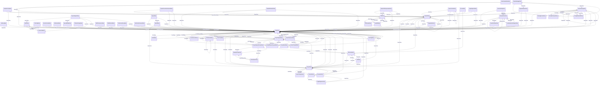

```mermaid
classDiagram
    class AuditLogEntity
    class AuthSessionEntity
    class AutoScheduleRuleEntity
    class BrokerProposalEntity
    class CalendarEventEntity
    class ContractEntity
    class DigitalSignatureEntity
    class DisputeActivityEntity
    class DisputeEvidenceEntity
    class DisputeHearingEntity
    class DisputeMessageEntity
    class DisputeNoteEntity
    class DisputeResolutionFeedbackEntity
    class DisputeSettlementEntity
    class DisputeSkillRequirementEntity
    class DisputeVerdictEntity
    class DisputeEntity
    class DocumentEntity
    class EscrowEntity
    class EventParticipantEntity
    class EventRescheduleRequestEntity
    class FeeConfigEntity
    class KycVerificationEntity
    class LegalSignatureEntity
    class MilestoneEntity
    class NotificationEntity
    class PayoutMethodEntity
    class PayoutRequestEntity
    class PlatformSettingsEntity
    class ProfileEntity
    class ProjectCategoryEntity
    class ProjectRequestAnswerEntity
    class ProjectRequestProposalEntity
    class ProjectRequestEntity
    class ProjectSpecEntity
    class ProjectEntity
    class ReportEntity
    class ReviewEntity
    class SavedFreelancerEntity
    class SkillDomainEntity
    class SkillEntity
    class SocialAccountEntity
    class StaffPerformanceEntity
    class StaffWorkloadEntity
    class TaskEntity
    class TransactionEntity
    class TrustScoreHistoryEntity
    class UserAvailabilityEntity
    class UserFlagEntity
    class UserSkillEntity
    class UserTokenEntity
    class UserEntity
    class VerificationDocumentEntity
    class WalletEntity
    class WizardOptionEntity
    class WizardQuestionEntity

    AuditLogEntity "* " --> "1" UserEntity : ManyToOne
    AuthSessionEntity "* " --> "1" UserEntity : ManyToOne
    AuthSessionEntity "* " --> "1" AuthSessionEntity : ManyToOne
    BrokerProposalEntity "* " --> "1" ProjectRequestEntity : ManyToOne
    BrokerProposalEntity "* " --> "1" UserEntity : ManyToOne
    CalendarEventEntity "* " --> "1" UserEntity : ManyToOne
    CalendarEventEntity "* " --> "1" CalendarEventEntity : ManyToOne
    CalendarEventEntity "1" --> "*" EventParticipantEntity : OneToMany
    CalendarEventEntity "1" --> "*" EventRescheduleRequestEntity : OneToMany
    ContractEntity "* " --> "1" ProjectEntity : ManyToOne
    ContractEntity "* " --> "1" UserEntity : ManyToOne
    ContractEntity "1" --> "*" DigitalSignatureEntity : OneToMany
    DigitalSignatureEntity "* " --> "1" ContractEntity : ManyToOne
    DigitalSignatureEntity "* " --> "1" UserEntity : ManyToOne
    DisputeActivityEntity "* " --> "1" DisputeEntity : ManyToOne
    DisputeActivityEntity "* " --> "1" UserEntity : ManyToOne
    DisputeEvidenceEntity "* " --> "1" DisputeEntity : ManyToOne
    DisputeEvidenceEntity "* " --> "1" UserEntity : ManyToOne
    DisputeEvidenceEntity "* " --> "1" UserEntity : ManyToOne
    DisputeHearingEntity "* " --> "1" DisputeEntity : ManyToOne
    DisputeHearingEntity "* " --> "1" UserEntity : ManyToOne
    DisputeHearingEntity "1" --> "*" HearingParticipantEntity : OneToMany
    DisputeHearingEntity "1" --> "*" HearingStatementEntity : OneToMany
    DisputeHearingEntity "1" --> "*" HearingQuestionEntity : OneToMany
    DisputeHearingEntity "* " --> "1" DisputeHearingEntity : ManyToOne
    DisputeHearingEntity "* " --> "1" UserEntity : ManyToOne
    DisputeHearingEntity "* " --> "1" DisputeHearingEntity : ManyToOne
    DisputeHearingEntity "* " --> "1" HearingParticipantEntity : ManyToOne
    DisputeHearingEntity "* " --> "1" HearingStatementEntity : ManyToOne
    DisputeHearingEntity "* " --> "1" HearingStatementEntity : ManyToOne
    DisputeHearingEntity "* " --> "1" DisputeHearingEntity : ManyToOne
    DisputeHearingEntity "* " --> "1" UserEntity : ManyToOne
    DisputeHearingEntity "* " --> "1" UserEntity : ManyToOne
    DisputeHearingEntity "* " --> "1" UserEntity : ManyToOne
    DisputeMessageEntity "* " --> "1" DisputeEntity : ManyToOne
    DisputeMessageEntity "* " --> "1" UserEntity : ManyToOne
    DisputeMessageEntity "* " --> "1" DisputeMessageEntity : ManyToOne
    DisputeMessageEntity "* " --> "1" DisputeEvidenceEntity : ManyToOne
    DisputeMessageEntity "* " --> "1" DisputeHearingEntity : ManyToOne
    DisputeNoteEntity "* " --> "1" DisputeEntity : ManyToOne
    DisputeNoteEntity "* " --> "1" UserEntity : ManyToOne
    DisputeResolutionFeedbackEntity "* " --> "1" DisputeEntity : ManyToOne
    DisputeResolutionFeedbackEntity "* " --> "1" UserEntity : ManyToOne
    DisputeResolutionFeedbackEntity "* " --> "1" UserEntity : ManyToOne
    DisputeSettlementEntity "* " --> "1" DisputeEntity : ManyToOne
    DisputeSettlementEntity "* " --> "1" UserEntity : ManyToOne
    DisputeSettlementEntity "* " --> "1" UserEntity : ManyToOne
    DisputeSkillRequirementEntity "* " --> "1" DisputeEntity : ManyToOne
    DisputeSkillRequirementEntity "* " --> "1" SkillEntity : ManyToOne
    DisputeSkillRequirementEntity "* " --> "1" UserEntity : ManyToOne
    DisputeSkillRequirementEntity "* " --> "1" SkillEntity : ManyToOne
    DisputeVerdictEntity "1" -- "1" DisputeEntity : OneToOne
    DisputeVerdictEntity "* " --> "1" UserEntity : ManyToOne
    DisputeVerdictEntity "* " --> "1" DisputeVerdictEntity : ManyToOne
    DisputeEntity "* " --> "1" ProjectEntity : ManyToOne
    DisputeEntity "* " --> "1" UserEntity : ManyToOne
    DisputeEntity "* " --> "1" UserEntity : ManyToOne
    DisputeEntity "* " --> "1" UserEntity : ManyToOne
    DisputeEntity "* " --> "1" MilestoneEntity : ManyToOne
    DisputeEntity "* " --> "1" DisputeEntity : ManyToOne
    DisputeEntity "1" --> "*" DisputeNoteEntity : OneToMany
    DisputeEntity "1" --> "*" DisputeActivityEntity : OneToMany
    DisputeEntity "* " --> "1" UserEntity : ManyToOne
    DisputeEntity "* " --> "1" UserEntity : ManyToOne
    DocumentEntity "* " --> "1" ProjectEntity : ManyToOne
    DocumentEntity "* " --> "1" UserEntity : ManyToOne
    EscrowEntity "* " --> "1" ProjectEntity : ManyToOne
    EscrowEntity "* " --> "1" MilestoneEntity : ManyToOne
    EscrowEntity "* " --> "1" DisputeEntity : ManyToOne
    EventParticipantEntity "* " --> "1" CalendarEventEntity : ManyToOne
    EventParticipantEntity "* " --> "1" UserEntity : ManyToOne
    EventRescheduleRequestEntity "* " --> "1" CalendarEventEntity : ManyToOne
    EventRescheduleRequestEntity "* " --> "1" UserEntity : ManyToOne
    EventRescheduleRequestEntity "* " --> "1" UserEntity : ManyToOne
    EventRescheduleRequestEntity "* " --> "1" CalendarEventEntity : ManyToOne
    FeeConfigEntity "* " --> "1" UserEntity : ManyToOne
    KycVerificationEntity "* " --> "1" UserEntity : ManyToOne
    KycVerificationEntity "* " --> "1" UserEntity : ManyToOne
    LegalSignatureEntity "* " --> "1" DisputeEntity : ManyToOne
    LegalSignatureEntity "* " --> "1" UserEntity : ManyToOne
    MilestoneEntity "* " --> "1" ProjectEntity : ManyToOne
    MilestoneEntity "1" --> "*" TaskEntity : OneToMany
    MilestoneEntity "* " --> "1" ProjectSpecEntity : ManyToOne
    NotificationEntity "* " --> "1" UserEntity : ManyToOne
    PayoutMethodEntity "* " --> "1" UserEntity : ManyToOne
    PayoutRequestEntity "* " --> "1" WalletEntity : ManyToOne
    PayoutRequestEntity "* " --> "1" PayoutMethodEntity : ManyToOne
    PayoutRequestEntity "* " --> "1" TransactionEntity : ManyToOne
    PayoutRequestEntity "* " --> "1" UserEntity : ManyToOne
    PayoutRequestEntity "* " --> "1" UserEntity : ManyToOne
    PlatformSettingsEntity "* " --> "1" UserEntity : ManyToOne
    ProfileEntity "1" -- "1" UserEntity : OneToOne
    ProjectRequestAnswerEntity "* " --> "1" ProjectRequestEntity : ManyToOne
    ProjectRequestAnswerEntity "* " --> "1" WizardQuestionEntity : ManyToOne
    ProjectRequestAnswerEntity "* " --> "1" WizardOptionEntity : ManyToOne
    ProjectRequestProposalEntity "* " --> "1" ProjectRequestEntity : ManyToOne
    ProjectRequestProposalEntity "* " --> "1" UserEntity : ManyToOne
    ProjectRequestProposalEntity "* " --> "1" UserEntity : ManyToOne
    ProjectRequestEntity "* " --> "1" UserEntity : ManyToOne
    ProjectRequestEntity "* " --> "1" UserEntity : ManyToOne
    ProjectRequestEntity "1" --> "*" ProjectRequestAnswerEntity : OneToMany
    ProjectRequestEntity "1" --> "*" ProjectRequestProposalEntity : OneToMany
    ProjectRequestEntity "1" -- "1" ProjectSpecEntity : OneToOne
    ProjectRequestEntity "1" --> "*" BrokerProposalEntity : OneToMany
    ProjectSpecEntity "1" -- "1" ProjectRequestEntity : OneToOne
    ProjectSpecEntity "1" --> "*" MilestoneEntity : OneToMany
    ProjectEntity "* " --> "1" ProjectRequestEntity : ManyToOne
    ProjectEntity "* " --> "1" UserEntity : ManyToOne
    ProjectEntity "* " --> "1" UserEntity : ManyToOne
    ProjectEntity "* " --> "1" UserEntity : ManyToOne
    ProjectEntity "1" --> "*" MilestoneEntity : OneToMany
    ProjectEntity "1" --> "*" ContractEntity : OneToMany
    ProjectEntity "1" --> "*" DocumentEntity : OneToMany
    ProjectEntity "*" -- "*" ProjectCategoryEntity : ManyToMany
    ReportEntity "* " --> "1" UserEntity : ManyToOne
    ReportEntity "* " --> "1" ReviewEntity : ManyToOne
    ReportEntity "* " --> "1" UserEntity : ManyToOne
    ReviewEntity "* " --> "1" ProjectEntity : ManyToOne
    ReviewEntity "* " --> "1" UserEntity : ManyToOne
    ReviewEntity "* " --> "1" UserEntity : ManyToOne
    SavedFreelancerEntity "* " --> "1" UserEntity : ManyToOne
    SavedFreelancerEntity "* " --> "1" UserEntity : ManyToOne
    SkillDomainEntity "1" --> "*" SkillEntity : OneToMany
    SkillEntity "* " --> "1" SkillDomainEntity : ManyToOne
    SkillEntity "1" --> "*" UserSkillEntity : OneToMany
    SocialAccountEntity "* " --> "1" UserEntity : ManyToOne
    StaffPerformanceEntity "* " --> "1" UserEntity : ManyToOne
    StaffWorkloadEntity "* " --> "1" UserEntity : ManyToOne
    TaskEntity "* " --> "1" MilestoneEntity : ManyToOne
    TaskEntity "* " --> "1" ProjectEntity : ManyToOne
    TaskEntity "* " --> "1" UserEntity : ManyToOne
    TransactionEntity "* " --> "1" WalletEntity : ManyToOne
    TrustScoreHistoryEntity "* " --> "1" UserEntity : ManyToOne
    UserAvailabilityEntity "* " --> "1" UserEntity : ManyToOne
    UserAvailabilityEntity "* " --> "1" CalendarEventEntity : ManyToOne
    UserFlagEntity "* " --> "1" UserEntity : ManyToOne
    UserFlagEntity "* " --> "1" UserEntity : ManyToOne
    UserFlagEntity "* " --> "1" UserEntity : ManyToOne
    UserFlagEntity "* " --> "1" UserEntity : ManyToOne
    UserSkillEntity "* " --> "1" UserEntity : ManyToOne
    UserSkillEntity "* " --> "1" SkillEntity : ManyToOne
    UserSkillEntity "* " --> "1" UserEntity : ManyToOne
    UserSkillEntity "* " --> "1" SkillEntity : ManyToOne
    UserTokenEntity "* " --> "1" UserEntity : ManyToOne
    UserEntity "1" -- "1" ProfileEntity : OneToOne
    UserEntity "1" --> "*" SocialAccountEntity : OneToMany
    UserEntity "1" --> "*" AuthSessionEntity : OneToMany
    UserEntity "1" --> "*" UserTokenEntity : OneToMany
    UserEntity "1" --> "*" SavedFreelancerEntity : OneToMany
    UserEntity "1" --> "*" ProjectRequestEntity : OneToMany
    UserEntity "1" --> "*" ProjectRequestEntity : OneToMany
    UserEntity "1" --> "*" ProjectRequestProposalEntity : OneToMany
    UserEntity "1" --> "*" BrokerProposalEntity : OneToMany
    UserEntity "1" --> "*" ProjectEntity : OneToMany
    UserEntity "1" --> "*" ProjectEntity : OneToMany
    UserEntity "1" --> "*" ProjectEntity : OneToMany
    UserEntity "1" --> "*" UserFlagEntity : OneToMany
    VerificationDocumentEntity "* " --> "1" UserEntity : ManyToOne
    VerificationDocumentEntity "* " --> "1" UserEntity : ManyToOne
    WalletEntity "* " --> "1" UserEntity : ManyToOne
    WalletEntity "1" --> "*" TransactionEntity : OneToMany
    WizardOptionEntity "* " --> "1" WizardQuestionEntity : ManyToOne
    WizardQuestionEntity "1" --> "*" WizardOptionEntity : OneToMany
    WizardQuestionEntity "1" --> "*" ProjectRequestAnswerEntity : OneToMany
```