# 💰 Deposit Flow (Nạp Tiền)

## Luồng nạp tiền từ Bank/E-wallet vào Client Wallet

```mermaid
sequenceDiagram
    actor Client
    participant UI as Client Portal
    participant API as Backend API
    participant Wallet as Wallet Service
    participant Gateway as Payment Gateway
    participant Bank as Bank/Momo
    participant DB as Database

    Client->>UI: Click "Nạp tiền"
    UI->>Client: Hiển thị form nhập số tiền
    Client->>UI: Nhập amount (VD: 10,000,000 VND)
    UI->>API: POST /wallet/deposit

    API->>Wallet: createDepositTransaction()
    Wallet->>DB: Insert Transaction(DEPOSIT, PENDING)
    DB-->>Wallet: transaction.id

    Wallet->>Gateway: generatePaymentUrl(amount, transactionId)
    Gateway-->>Wallet: paymentUrl, gatewayTransactionId

    Wallet->>DB: Update transaction.externalTransactionId
    Wallet-->>API: { paymentUrl, transactionId }
    API-->>UI: Return payment URL

    UI->>Client: Redirect to Payment Gateway
    Client->>Gateway: Authorize payment
    Gateway->>Bank: Transfer request
    Bank-->>Gateway: Transfer confirmed

    Gateway->>API: Webhook: Payment Success
    API->>Wallet: processDepositCallback()

    Wallet->>DB: BEGIN TRANSACTION
    Wallet->>DB: Update Transaction(COMPLETED)
    Wallet->>DB: wallet.balance += amount
    Wallet->>DB: wallet.totalDeposited += amount
    Wallet->>DB: COMMIT

    Wallet-->>API: Deposit completed
    API->>UI: Notify "Nạp tiền thành công"
    UI->>Client: Show success message
```



---

## State Diagram cho Transaction

```mermaid
stateDiagram-v2
    [*] --> PENDING: Client tạo deposit request
    PENDING --> PROCESSING: Gateway xác nhận
    PROCESSING --> COMPLETED: Transfer thành công
    PROCESSING --> FAILED: Transfer thất bại
    PENDING --> CANCELLED: Client hủy

    FAILED --> [*]
    CANCELLED --> [*]
    COMPLETED --> [*]

    note right of COMPLETED
        - wallet.balance += amount
        - wallet.totalDeposited += amount
        - Transaction status = COMPLETED
    end note
```



---

## Database Changes

### Transaction Record

```typescript
{
  id: "uuid",
  walletId: "client-wallet-id",
  type: "DEPOSIT",
  amount: 10000000,
  fee: 0,
  netAmount: 10000000,
  status: "COMPLETED",
  paymentMethod: "VNPAY",
  externalTransactionId: "VNPAY_123456",
  metadata: {
    bankName: "Vietcombank",
    accountNumber: "****1234",
    gatewayResponse: { ... }
  },
  completedAt: "2026-01-08T13:15:00Z"
}
```

### Wallet Update

```typescript
Before:
  balance: 5,000,000
  totalDeposited: 50,000,000

After:
  balance: 15,000,000 (+10M)
  totalDeposited: 60,000,000 (+10M)
```

---

## Error Handling


