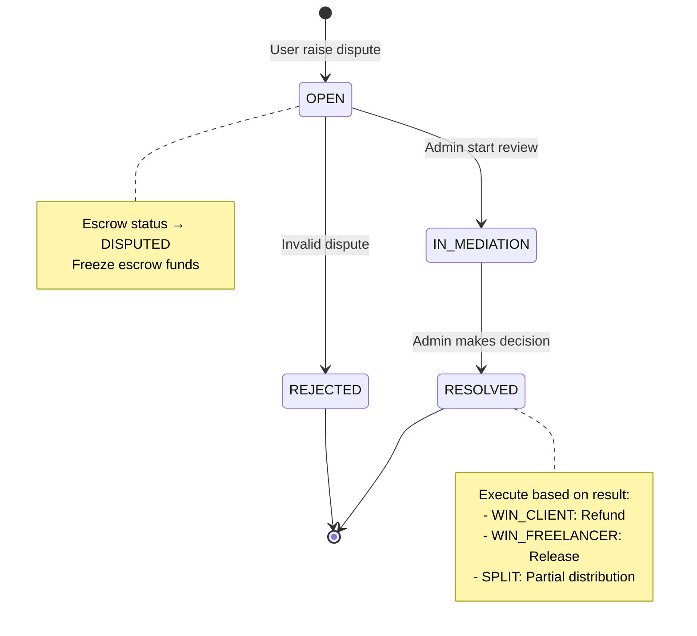
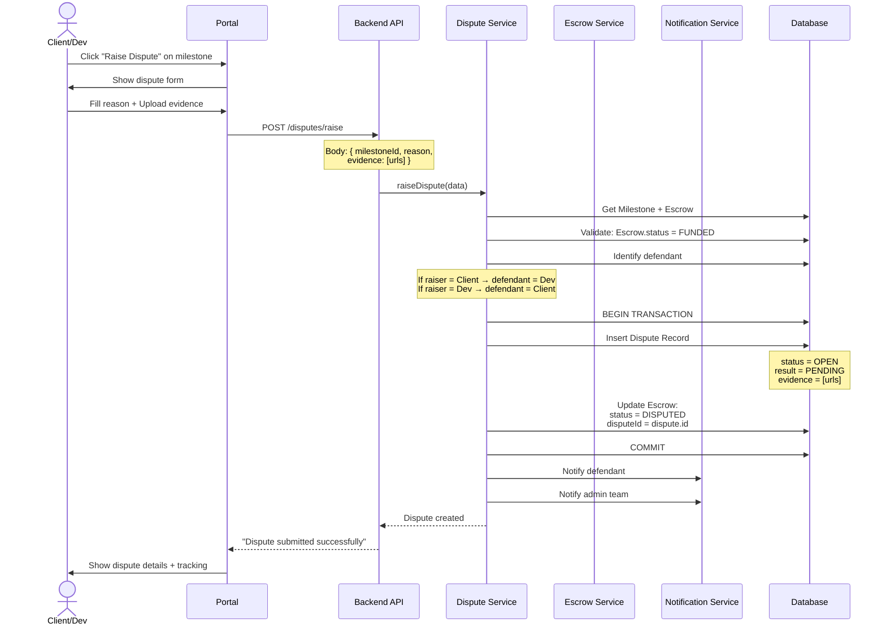
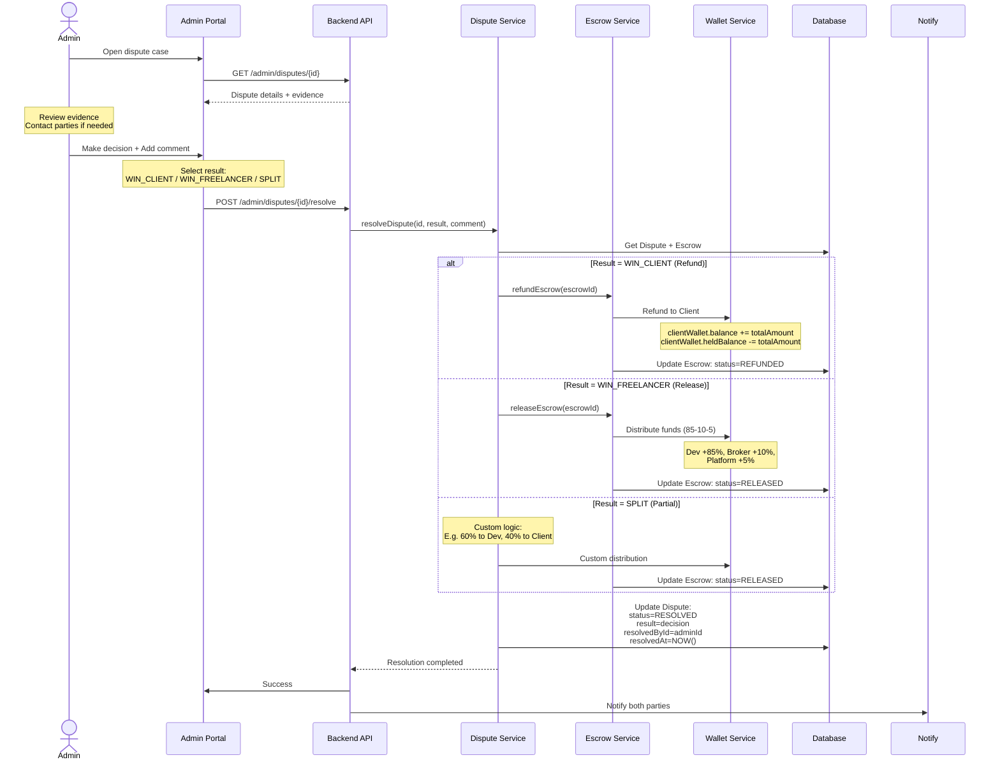
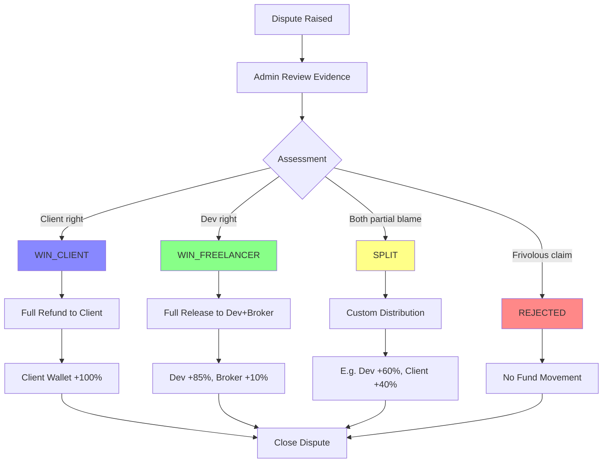
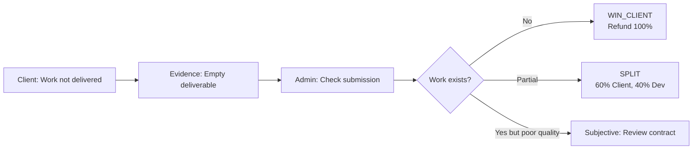
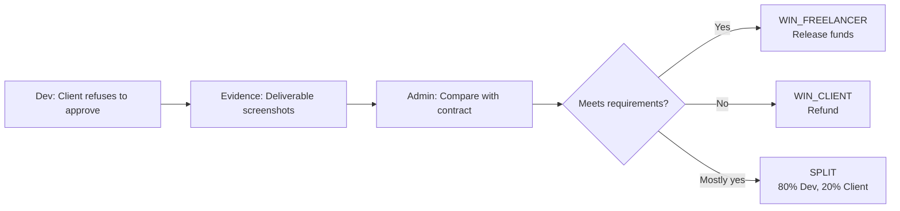
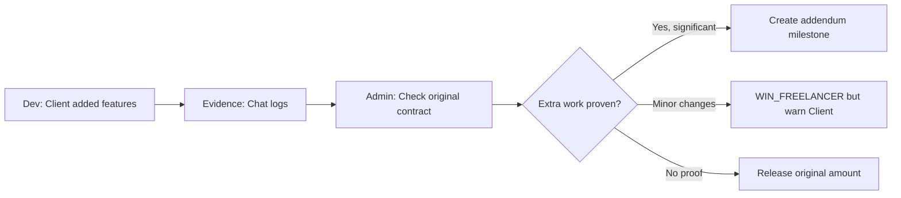
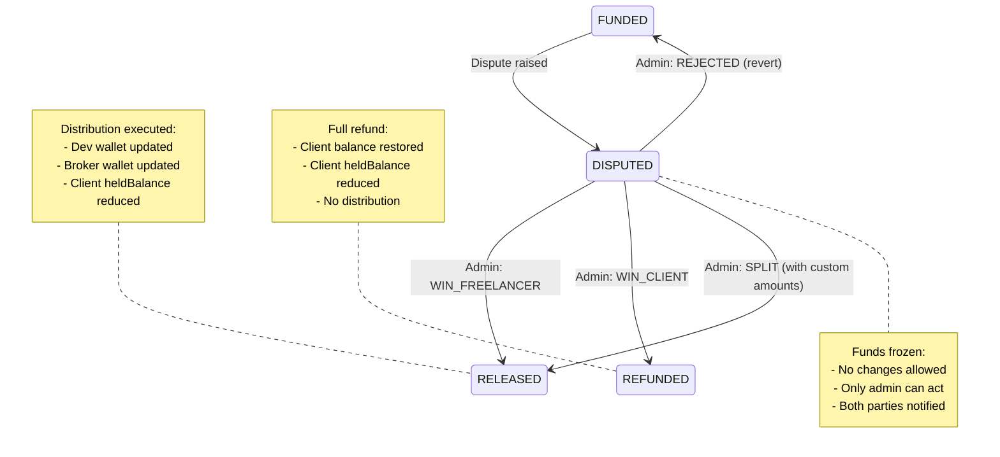
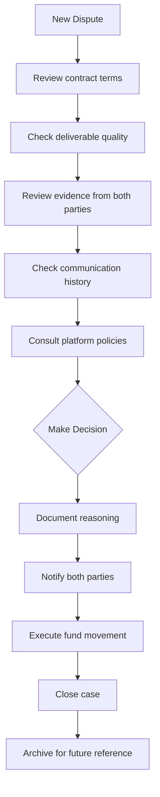

# ⚖️ Dispute Resolution Flow (Tranh Chấp)

## Tổng quan Dispute Lifecycle



---

## 1. Raise Dispute (User Flow)



---

## 2. Admin Resolution Flow



---

## 3. Decision Matrix



---

## 4. Common Dispute Scenarios

### Scenario A: Milestone Not Delivered



### Scenario B: Client Won't Approve



### Scenario C: Scope Creep



---

## 5. Escrow State Changes



---

## Database Records

### Dispute Record

```typescript
{
  id: "dispute-uuid",
  projectId: "project-uuid",
  milestoneId: "milestone-uuid",

  raisedById: "client-uuid",
  defendantId: "dev-uuid",

  reason: "Developer did not deliver the mobile app as specified in contract. Only web version was delivered.",
  evidence: [
    "https://storage.interdev.com/disputes/screenshot1.png",
    "https://storage.interdev.com/disputes/contract.pdf"
  ],

  status: "RESOLVED",
  result: "WIN_CLIENT",

  adminComment: "Reviewed contract and deliverables. Mobile app requirement was clearly stated but not delivered. Full refund approved.",

  resolvedById: "admin-uuid",
  resolvedAt: "2026-01-08T17:00:00Z",
  createdAt: "2026-01-08T16:00:00Z"
}
```

### Linked Escrow Update

```typescript
Before Dispute:
{
  status: "FUNDED",
  disputeId: null
}

During Dispute:
{
  status: "DISPUTED",
  disputeId: "dispute-uuid"
}

After Resolution (WIN_CLIENT):
{
  status: "REFUNDED",
  disputeId: "dispute-uuid",
  refundedAt: "2026-01-08T17:00:00Z"
}
```

---

## Admin Resolution Checklist



### Admin Tools

- 📄 Contract viewer
- 💬 Full chat history
- 📁 Deliverable comparison tool
- 📊 User trust score/history
- 🕒 Timeline visualization
- 📸 Evidence viewer

---

## Notifications

### To Defendant (when dispute raised)

> ⚠️ **Dispute Raised**  
> {Raiser} has raised a dispute on milestone "{Milestone Name}".  
> Reason: {Dispute Reason}  
> You have 48 hours to submit your response and evidence.

### To Both Parties (when resolved)

> ✅ **Dispute Resolved**  
> Admin decision: {Result}  
> Reason: {Admin Comment}  
> Funds have been {refunded/released} accordingly.
