# 💰 Complete Money Flow (Tổng Quan Toàn Bộ Hệ Thống)

## High-Level Architecture

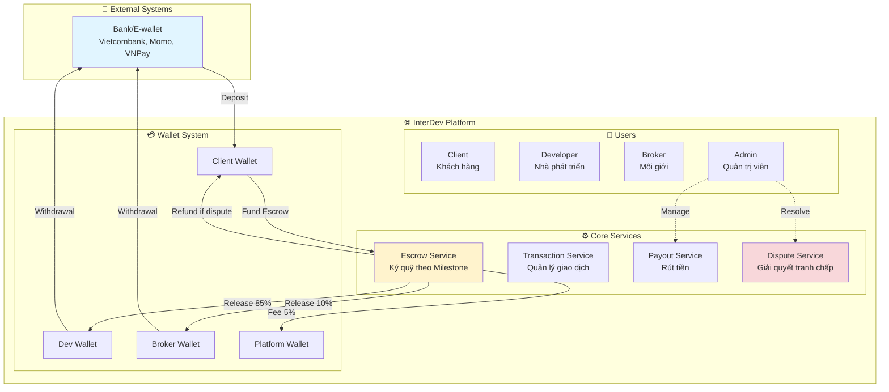

---

## Complete User Journey: From Deposit to Withdrawal

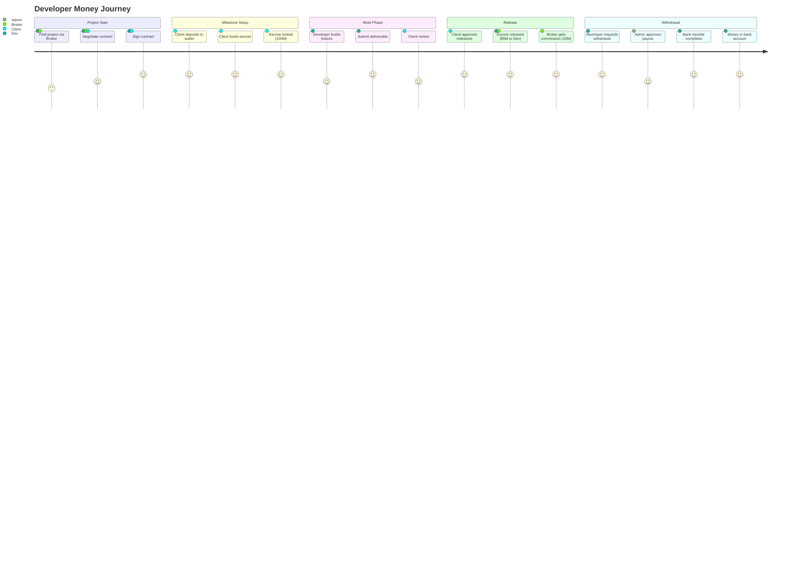

---

## Money Flow Timeline

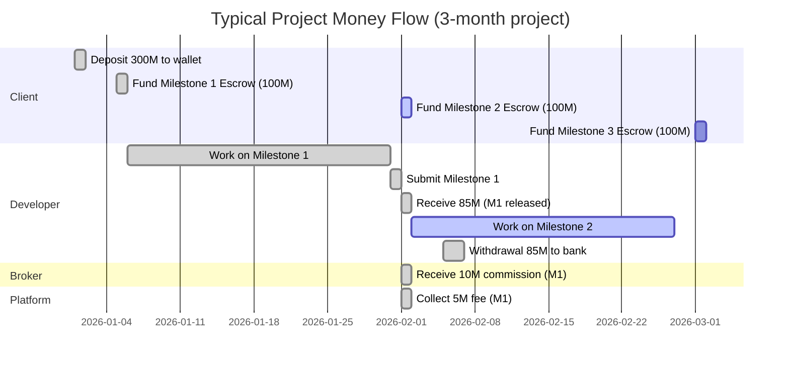

---

## Fund Distribution Breakdown

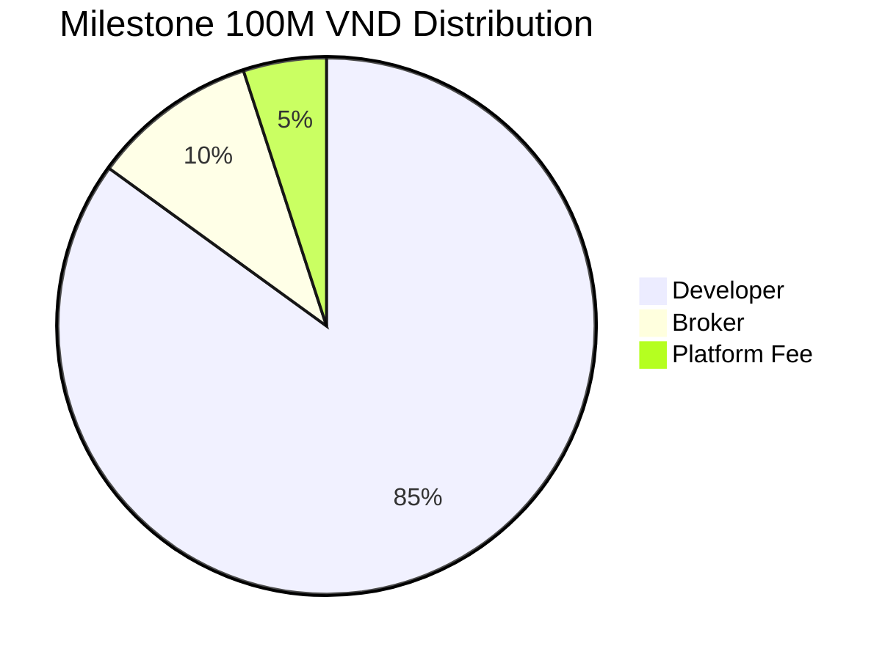

---

## System Flow: All Actors

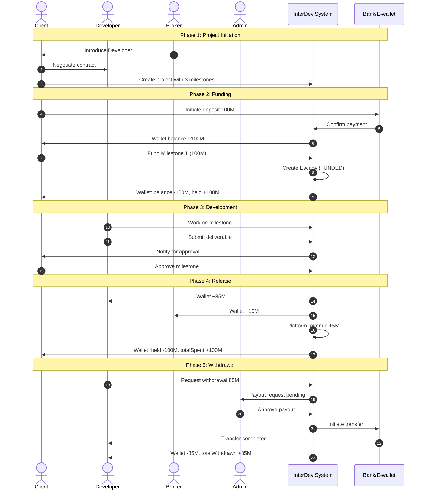

---

## Wallet Balance States

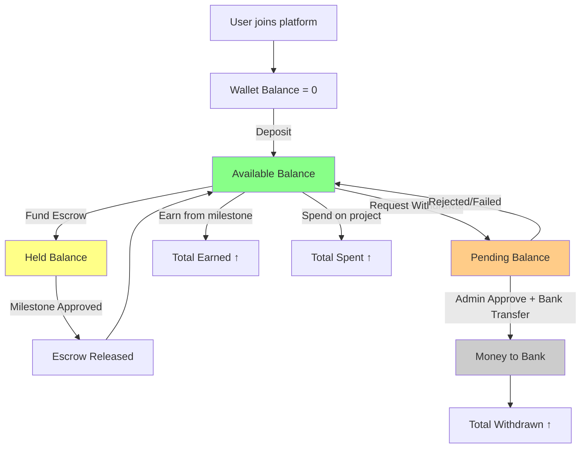

### Real Example: Client Journey

```typescript
Initial State:
  balance: 0
  pendingBalance: 0
  heldBalance: 0

After deposit 500M:
  balance: 500,000,000 ✅
  pendingBalance: 0
  heldBalance: 0

After fund Milestone 1 (200M):
  balance: 300,000,000
  pendingBalance: 0
  heldBalance: 200,000,000 🔒

After milestone approved (funds distributed):
  balance: 300,000,000
  pendingBalance: 0
  heldBalance: 0
  totalSpent: 200,000,000
```

### Real Example: Developer Journey

```typescript
Initial State:
  balance: 0
  pendingBalance: 0
  heldBalance: 0

After Milestone 1 released (170M = 200M * 85%):
  balance: 170,000,000 💰
  pendingBalance: 0
  heldBalance: 0
  totalEarned: 170,000,000

After withdrawal request 170M:
  balance: 0
  pendingBalance: 170,000,000 ⏳
  heldBalance: 0

After withdrawal completed:
  balance: 0
  pendingBalance: 0
  heldBalance: 0
  totalWithdrawn: 170,000,000 🏦
```

---

## Error & Edge Cases

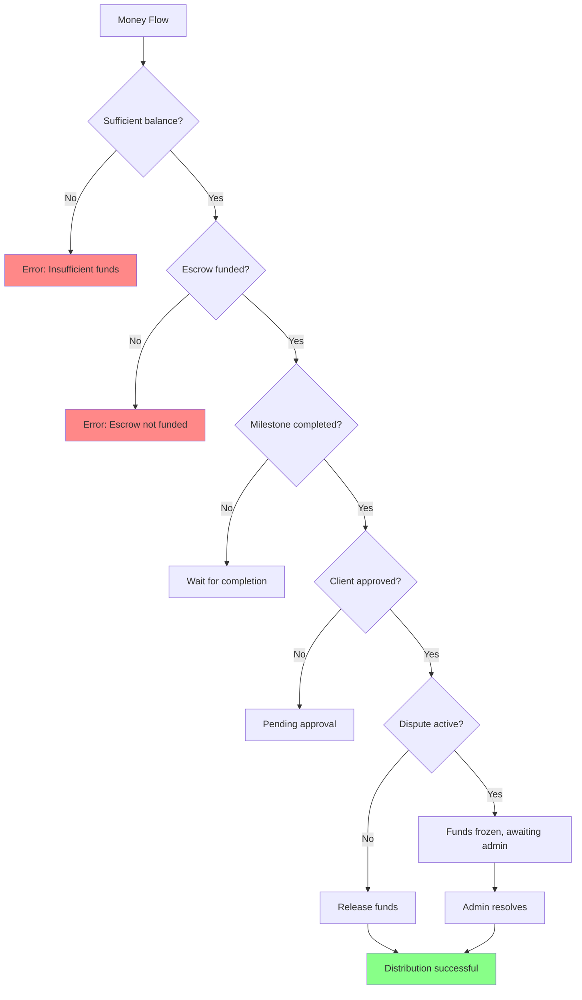

---

## Transaction Types Overview

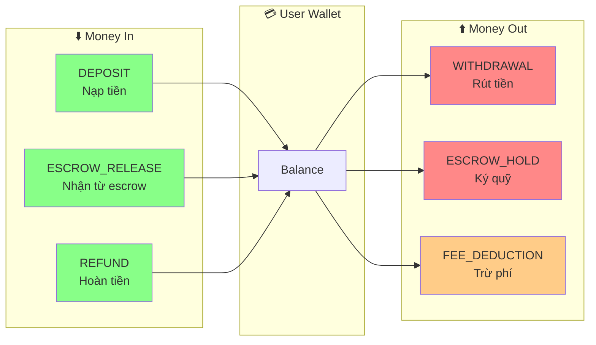

---

## Platform Revenue Model

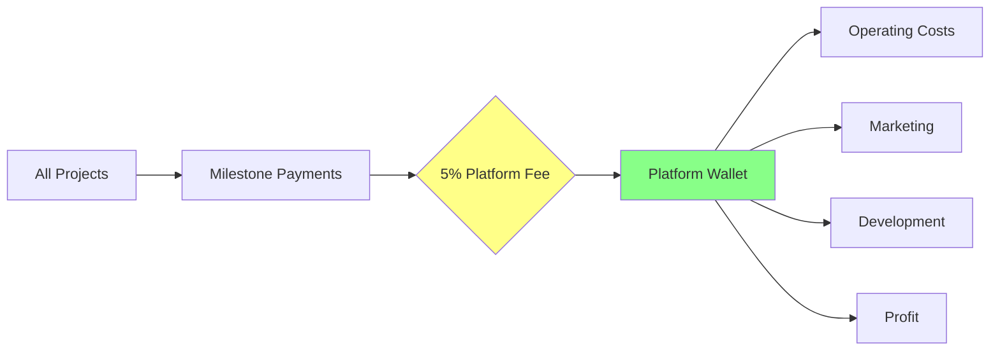

### Revenue Calculation Example

```
Month: January 2026
Total Milestones Released: 50
Average Milestone Value: 100,000,000 VND

Total Project Value: 5,000,000,000 VND (5 billion)
Platform Revenue (5%): 250,000,000 VND (250 million)

Distribution:
- Developers (85%): 4,250,000,000 VND
- Brokers (10%): 500,000,000 VND
- Platform (5%): 250,000,000 VND
```

---

## Security & Compliance

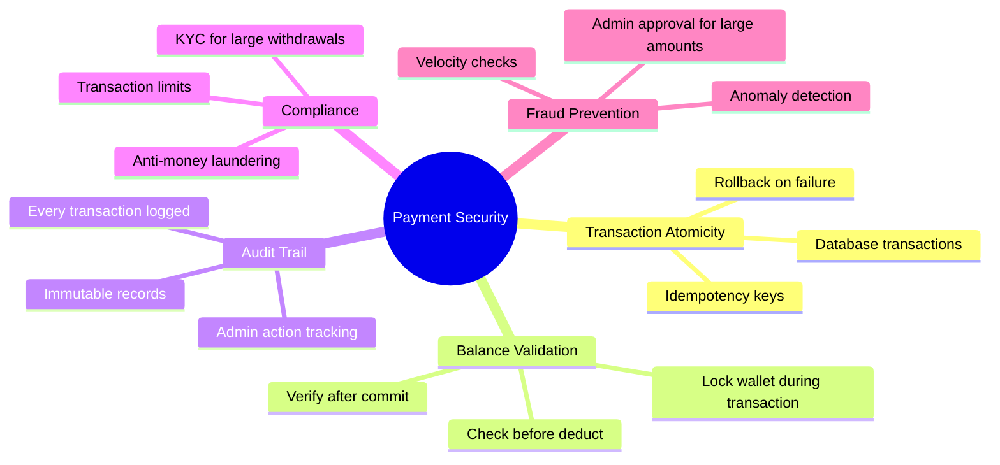

---

## Key Metrics to Track

| Metric                            | Description                    | Formula                             |
| --------------------------------- | ------------------------------ | ----------------------------------- |
| **GMV** (Gross Merchandise Value) | Tổng giá trị giao dịch         | Sum of all milestone values         |
| **Platform Revenue**              | Doanh thu platform             | GMV × 5%                            |
| **Avg. Project Value**            | Giá trị trung bình mỗi project | Total project value / Project count |
| **Withdrawal Rate**               | Tỷ lệ rút tiền                 | Withdrawn / Earned                  |
| **Dispute Rate**                  | Tỷ lệ tranh chấp               | Disputes / Total milestones         |
| **Escrow Locked**                 | Tổng tiền đang ký quỹ          | Sum of FUNDED escrows               |

---

## System Health Checks

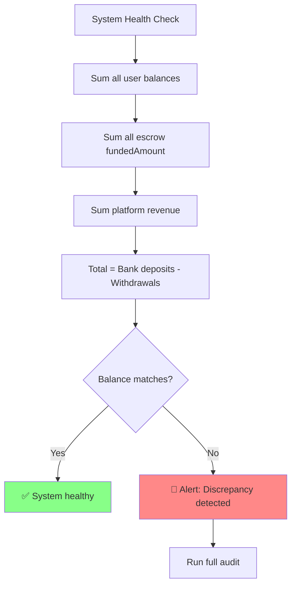

**Integrity Formula:**

```
User Wallets (balance + pending + held)
+ Platform Revenue
+ Total Withdrawn
= Total Deposited
```
