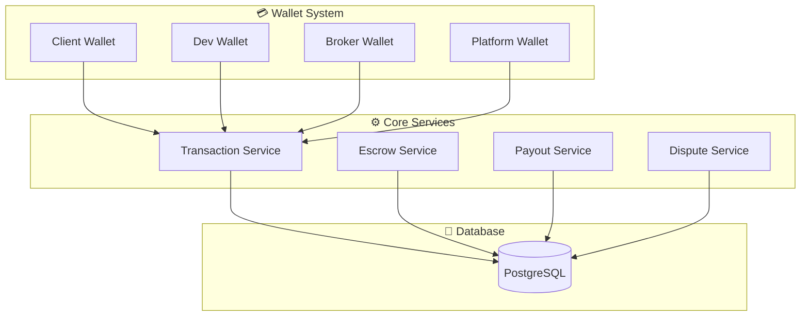

# 📚 InterDev Payment Schema Documentation

> **Tài liệu hệ thống thanh toán & ví tiền cho InterDev Platform**  
> Phiên bản: v1.0 | Cập nhật: 2026-01-08

---

## 📖 Tổng Quan

Thư mục này chứa toàn bộ tài liệu về kiến trúc payment/wallet của InterDev, bao gồm:

- Database schema & entities
- Money flow diagrams
- User journeys
- API workflows

### Mô hình kinh doanh

- **1 Developer - 1 Broker - 1 Client**
- **Phân bổ:** Dev (85%) + Broker (10%) + Platform (5%)
- **Escrow-based:** Ký quỹ theo từng milestone

---

## 📁 Cấu Trúc Tài Liệu

| File                                                     | Nội dung                                               | Độ phức tạp |
| -------------------------------------------------------- | ------------------------------------------------------ | ----------- |
| [full.md](./full.md)                                     | 📄 **Schema đầy đủ** - Entities, migrations, SQL       | ⭐⭐⭐⭐⭐  |
| [01-deposit-flow.md](./01-deposit-flow.md)               | 💰 **Luồng nạp tiền** - Client deposit to wallet       | ⭐⭐⭐      |
| [02-escrow-flow.md](./02-escrow-flow.md)                 | 🔒 **Luồng ký quỹ** - Escrow hold & release            | ⭐⭐⭐⭐    |
| [03-withdrawal-flow.md](./03-withdrawal-flow.md)         | 💸 **Luồng rút tiền** - Withdrawal with admin approval | ⭐⭐⭐⭐    |
| [04-dispute-flow.md](./04-dispute-flow.md)               | ⚖️ **Luồng tranh chấp** - Dispute resolution           | ⭐⭐⭐⭐⭐  |
| [05-complete-money-flow.md](./05-complete-money-flow.md) | 🌐 **Tổng quan toàn hệ thống** - End-to-end flow       | ⭐⭐⭐⭐⭐  |

---

## 🚀 Bắt Đầu Nhanh

### Cho Developer mới

1. Đọc [05-complete-money-flow.md](./05-complete-money-flow.md) để hiểu big picture
2. Đọc [full.md](./full.md) để hiểu database schema
3. Chọn flow cụ thể (deposit/escrow/withdrawal/dispute) để implement

### Cho Product/Business

1. Đọc [05-complete-money-flow.md](./05-complete-money-flow.md) - User journey
2. Đọc [02-escrow-flow.md](./02-escrow-flow.md) - Hiểu cách tiền được bảo vệ
3. Đọc [04-dispute-flow.md](./04-dispute-flow.md) - Quy trình giải quyết tranh chấp

### Cho QA/Tester

1. Đọc từng flow riêng lẻ (01-04) để hiểu test cases
2. Focus vào phần "Error Handling" trong mỗi file
3. Sử dụng state diagrams để tạo test scenarios

---

## 🏗️ Kiến Trúc Tổng Quan



---

## 📊 Key Entities

| Entity               | Purpose                      | Status         |
| -------------------- | ---------------------------- | -------------- |
| `WalletEntity`       | Quản lý ví tiền user         | ✅ Implemented |
| `TransactionEntity`  | Ghi nhận mọi giao dịch       | ✅ Implemented |
| `EscrowEntity`       | Ký quỹ theo milestone        | ✅ Implemented |
| `PayoutMethodEntity` | Tài khoản ngân hàng rút tiền | ✅ Implemented |
| `FeeConfigEntity`    | Cấu hình % phí               | ✅ Implemented |
| `DisputeEntity`      | Xử lý tranh chấp             | ✅ Enhanced    |

Xem chi tiết trong [full.md](./full.md) section 5.

---

## 💰 Money Flow Cheat Sheet

### Deposit (Nạp tiền)

```
Bank → Client Wallet (balance++)
```

### Fund Escrow (Ký quỹ)

```
Client Wallet (balance--, held++) → Escrow (FUNDED)
```

### Release Escrow (Giải ngân)

```
Escrow → Dev Wallet (85%) + Broker Wallet (10%) + Platform (5%)
Client (held--)
```

### Withdrawal (Rút tiền)

```
User Wallet (balance--, pending++)
→ Admin Approve
→ Bank Transfer
→ Wallet (pending--, totalWithdrawn++)
```

### Dispute Refund (Hoàn tiền)

```
Escrow (DISPUTED) → Admin Resolve → Client Wallet (balance++, held--)
```

---

## 🎯 Use Cases Phổ Biến

### 1️⃣ Happy Path: Milestone Success

```
Client deposit 100M
→ Fund escrow 100M
→ Dev complete work
→ Client approve
→ Release (Dev +85M, Broker +10M, Platform +5M)
→ Dev withdraw 85M to bank
```

### 2️⃣ Dispute Scenario

```
Client fund escrow 100M
→ Dev submit poor quality work
→ Client raise dispute
→ Admin review evidence
→ Refund 100M to Client
```

### 3️⃣ Multiple Milestones

```
Client deposit 300M
→ Fund M1 (100M), M2 (100M), M3 (100M)
→ M1 complete → Release 100M
→ M2 complete → Release 100M
→ M3 dispute → Refund 100M
```

---

## 📋 Implementation Checklist

### Backend (NestJS)

- [ ] Create entities (Wallet, Transaction, Escrow, PayoutMethod, FeeConfig)
- [ ] Run migrations
- [ ] Implement WalletService
- [ ] Implement EscrowService
- [ ] Implement PayoutService
- [ ] Implement DisputeService
- [ ] Add transaction atomicity (database transactions)
- [ ] Implement webhook handlers (payment gateways)
- [ ] Add admin approval flows
- [ ] Write unit tests
- [ ] Write integration tests

### Frontend (React)

- [ ] Client deposit page
- [ ] Wallet balance dashboard
- [ ] Fund escrow button (milestone page)
- [ ] Withdrawal request form
- [ ] Raise dispute modal
- [ ] Admin payout approval panel
- [ ] Admin dispute resolution panel
- [ ] Transaction history view

### DevOps

- [ ] Configure payment gateway credentials
- [ ] Set up webhook endpoints (public URL)
- [ ] Database backup strategy
- [ ] Monitoring & alerts (balance discrepancies)
- [ ] Audit logging

---

## 🔐 Security Considerations

### Critical Rules

1. **Transaction Atomicity:** Mọi thay đổi wallet phải wrap trong database transaction
2. **Balance Validation:** Luôn check balance trước khi deduct
3. **Idempotency:** Payment gateway webhooks có thể gọi nhiều lần
4. **Admin Approval:** Large withdrawals cần admin review
5. **Audit Trail:** Mọi transaction phải có log không thể xóa

### Integrity Formula

```typescript
Sum(all user wallets.balance + pending + held)
  + Sum(platform revenue)
  + Sum(total withdrawn)
= Sum(total deposited)
```

Nếu công thức này sai → **Có bug nghiêm trọng!**

---

## 🐛 Common Issues & Solutions

| Issue              | Root Cause                    | Solution                                        |
| ------------------ | ----------------------------- | ----------------------------------------------- |
| Balance mismatch   | Race condition                | Use database transactions + row locking         |
| Duplicate deposits | Webhook retry                 | Check `externalTransactionId` before processing |
| Escrow stuck       | Missing client approval       | Add timeout + auto-refund after 30 days         |
| Withdrawal failed  | Invalid bank info             | Add bank account verification step              |
| Platform fee wrong | FeeConfig changed mid-project | Use fee snapshot in EscrowEntity                |

---

## 📞 Support

Nếu có thắc mắc về payment system:

1. Đọc file flow tương ứng
2. Check [full.md](./full.md) section liên quan
3. Hỏi team lead hoặc tạo issue

---

## 📝 Changelog

### v1.0 (2026-01-08)

- ✅ Initial release
- ✅ Complete schema design
- ✅ All 5 flow diagrams
- ✅ Error handling & edge cases
- ✅ Mermaid diagrams for visualization

---

<div align="center">

**Made with ❤️ for InterDev Platform**

[Back to Top](#-interdev-payment-schema-documentation)

</div>
