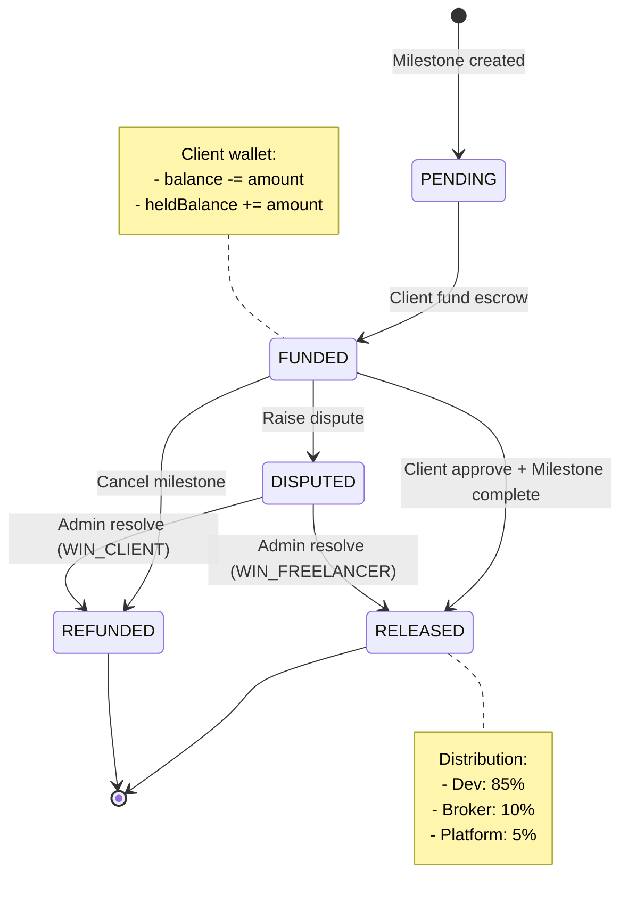
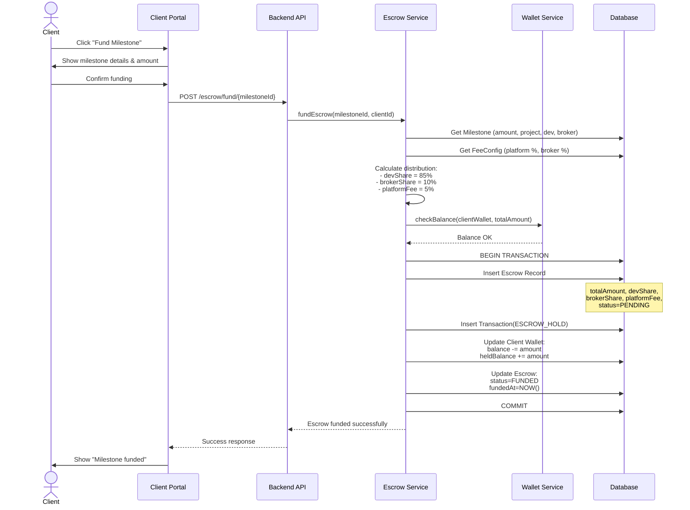
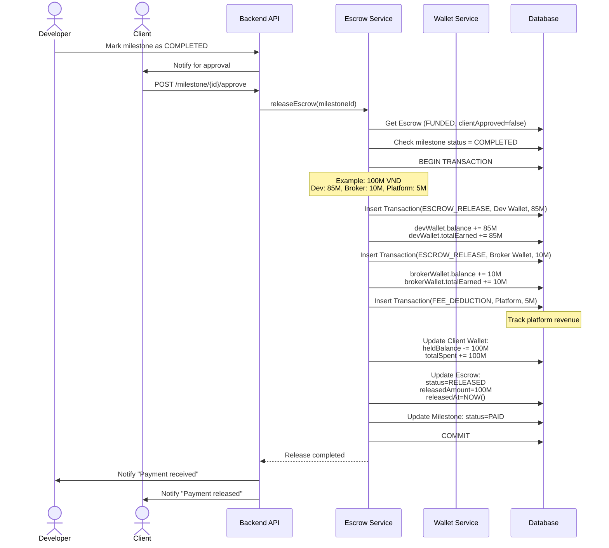
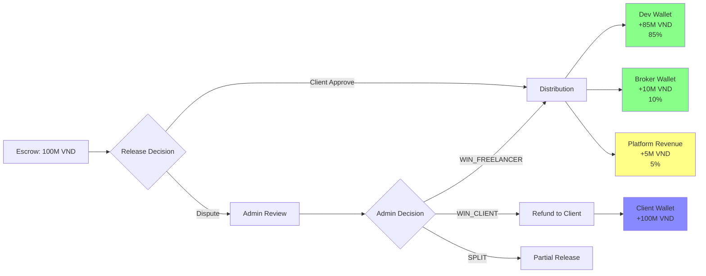

# 🔒 Escrow Flow (Ký Quỹ & Giải Ngân)

## Tổng quan Escrow Lifecycle



---

## 1. Escrow HOLD (Client Fund Milestone)



---

## 2. Escrow RELEASE (Giải Ngân)



---

## 3. Money Distribution Flowchart



---

## Database Records Example

### Escrow Record

```typescript
{
  id: "escrow-uuid",
  projectId: "project-uuid",
  milestoneId: "milestone-uuid",
  totalAmount: 100000000,
  fundedAmount: 100000000,
  releasedAmount: 100000000,

  // Snapshot (immutable)
  developerShare: 85000000,
  brokerShare: 10000000,
  platformFee: 5000000,
  developerPercentage: 85,
  brokerPercentage: 10,
  platformPercentage: 5,

  status: "RELEASED",
  clientApproved: true,
  clientApprovedAt: "2026-01-08T14:00:00Z",
  fundedAt: "2026-01-08T10:00:00Z",
  releasedAt: "2026-01-08T14:00:00Z"
}
```

### Generated Transactions

```typescript
// 1. Hold transaction
{
  type: "ESCROW_HOLD",
  walletId: "client-wallet",
  amount: -100000000,
  referenceType: "Escrow",
  referenceId: "escrow-uuid"
}

// 2. Release to Dev
{
  type: "ESCROW_RELEASE",
  walletId: "dev-wallet",
  amount: 85000000,
  referenceType: "Escrow",
  referenceId: "escrow-uuid"
}

// 3. Release to Broker
{
  type: "ESCROW_RELEASE",
  walletId: "broker-wallet",
  amount: 10000000,
  referenceType: "Escrow",
  referenceId: "escrow-uuid"
}

// 4. Platform fee
{
  type: "FEE_DEDUCTION",
  walletId: "platform-wallet",
  amount: 5000000,
  referenceType: "Escrow",
  referenceId: "escrow-uuid"
}
```
