# 💸 Withdrawal Flow (Rút Tiền)

## Luồng rút tiền từ Wallet về Bank Account

```mermaid
sequenceDiagram
    actor User as Dev/Broker
    participant UI as User Portal
    participant API as Backend API
    participant Payout as Payout Service
    participant Wallet as Wallet Service
    participant Admin as Admin Portal
    participant Bank as Bank Transfer API
    participant DB as Database

    User->>UI: Click "Rút tiền"
    UI->>User: Show available balance
    User->>UI: Enter amount + Select bank account

    UI->>API: POST /payout/request
    API->>Payout: createPayoutRequest()

    Payout->>Wallet: checkBalance(userId, amount)
    Wallet-->>Payout: Balance sufficient

    Payout->>DB: Get PayoutMethod (bank info)
    Payout->>DB: Check min/max withdrawal limits

    Payout->>DB: BEGIN TRANSACTION
    Payout->>DB: Insert PayoutRequest(PENDING)
    Payout->>DB: Insert Transaction(WITHDRAWAL, PENDING)
    Payout->>DB: wallet.balance -= amount<br/>wallet.pendingBalance += amount
    Payout->>DB: COMMIT

    Payout-->>API: Payout request created
    API-->>UI: "Request submitted, awaiting approval"

    Note over Admin: Admin reviews payout request

    Admin->>API: POST /admin/payout/{id}/approve
    API->>Payout: approvePayoutRequest(id, adminId)

    Payout->>DB: Update PayoutRequest(APPROVED)
    Payout->>DB: Update Transaction(PROCESSING)

    Payout->>Bank: transferFunds(bankInfo, amount)
    Bank-->>Payout: Transfer initiated (bankTxnId)

    Note over Bank: Bank processes transfer<br/>(1-24 hours)

    Bank->>API: Webhook: Transfer completed
    API->>Payout: completePayoutRequest()

    Payout->>DB: BEGIN TRANSACTION
    Payout->>DB: Update PayoutRequest(COMPLETED)
    Payout->>DB: Update Transaction(COMPLETED, completedAt)
    Payout->>DB: wallet.pendingBalance -= amount<br/>wallet.totalWithdrawn += amount
    Payout->>DB: COMMIT

    Payout-->>API: Payout completed
    API->>User: Notify "Withdrawal successful"
```



---

## State Diagram: PayoutRequest


---

## Admin Review Flow


---

## Wallet Balance States


### Example Calculation

```typescript
Before Withdrawal Request:
  balance: 50,000,000 (available to withdraw)
  pendingBalance: 0
  heldBalance: 20,000,000 (in active escrows)
  totalBalance: 70,000,000

User requests withdraw 30M:
  balance: 20,000,000 (-30M)
  pendingBalance: 30,000,000 (+30M)
  heldBalance: 20,000,000
  totalBalance: 70,000,000 (unchanged)

After withdrawal completed:
  balance: 20,000,000
  pendingBalance: 0 (-30M)
  heldBalance: 20,000,000
  totalBalance: 40,000,000 (-30M)
  totalWithdrawn: 30,000,000
```

---

## Database Models

### PayoutRequest

```typescript
{
  id: "payout-uuid",
  userId: "user-uuid",
  payoutMethodId: "bank-uuid",
  amount: 30000000,
  fee: 0,
  netAmount: 30000000,
  status: "COMPLETED",

  // Bank info snapshot
  bankName: "Vietcombank",
  accountNumber: "1234567890",
  accountHolderName: "NGUYEN VAN A",

  // Admin tracking
  approvedBy: "admin-uuid",
  approvedAt: "2026-01-08T15:00:00Z",

  // Bank tracking
  externalTransactionId: "BANK_TXN_999",
  completedAt: "2026-01-08T16:30:00Z",

  notes: "Monthly withdrawal",
  createdAt: "2026-01-08T14:00:00Z"
}
```

### PayoutMethod (Bank Account)

```typescript
{
  id: "bank-uuid",
  userId: "user-uuid",
  bankName: "Vietcombank",
  bankCode: "VCB",
  accountNumber: "1234567890",
  accountHolderName: "NGUYEN VAN A",
  branchName: "VCB Ha Noi",
  isDefault: true,
  isVerified: true,
  verifiedAt: "2025-12-01T10:00:00Z"
}
```

---

## Error Handling

### Common Rejection Reasons

- ❌ Insufficient balance
- ❌ Bank info mismatch (name vs ID)
- ❌ Suspicious activity pattern
- ❌ Account not verified
- ❌ Amount below minimum (100,000 VND)
- ❌ Amount above daily limit

### Failed Transfer Recovery


