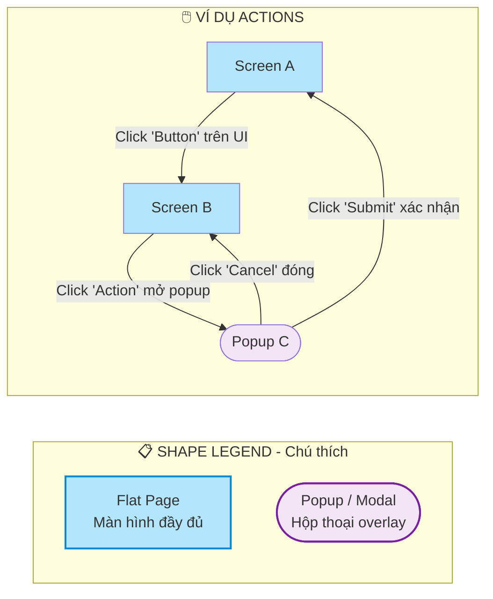
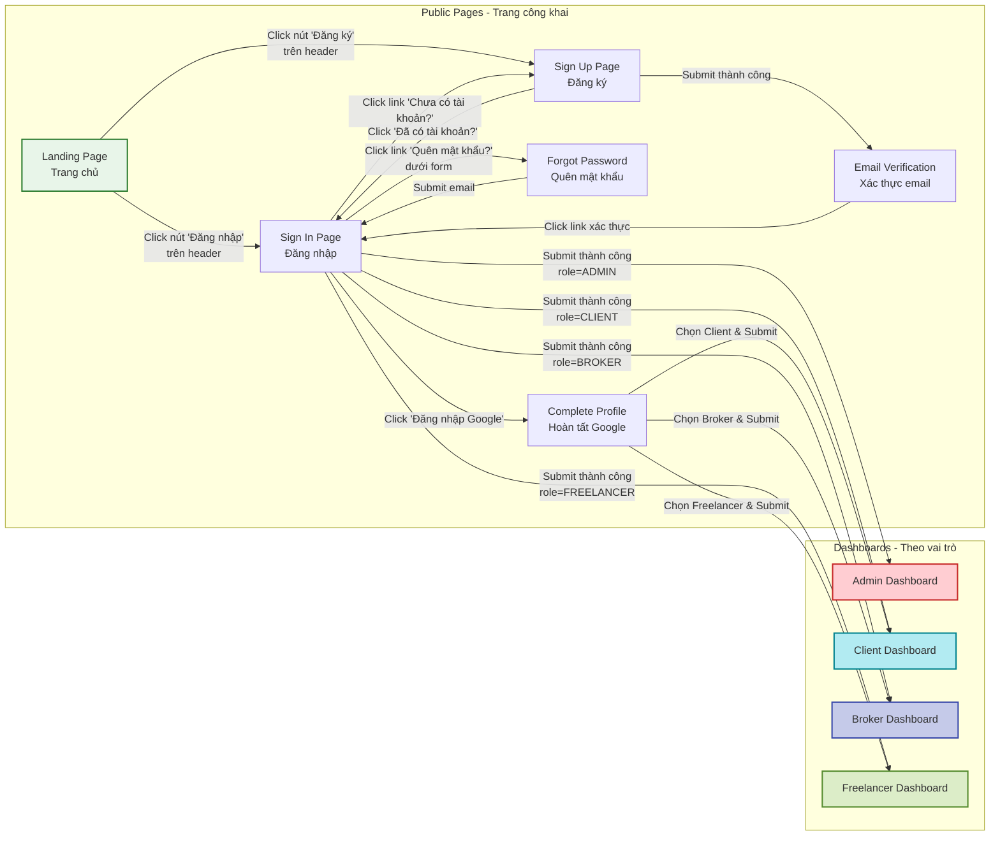
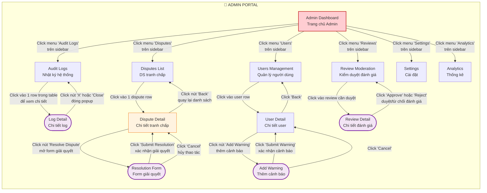
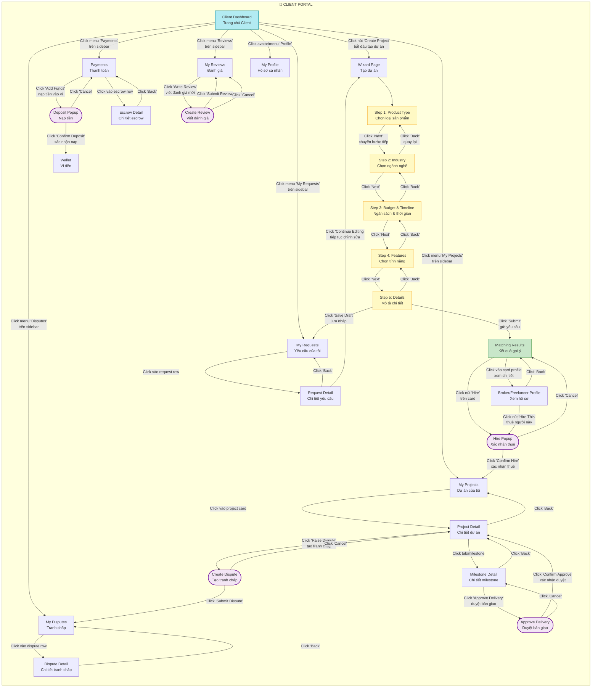
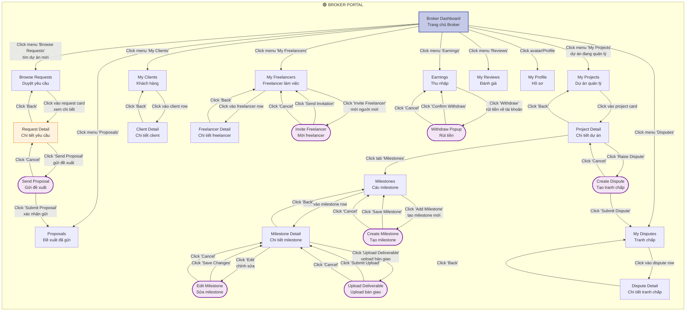
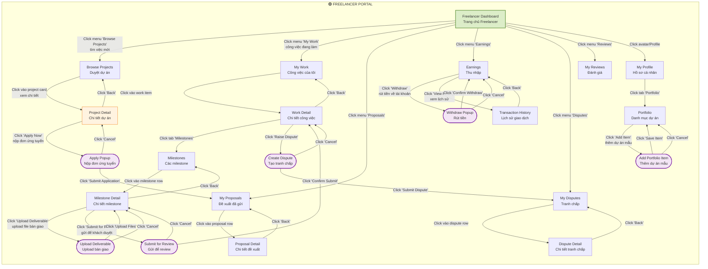

# 🎨 Detailed Screen Flows - InterDev Platform

> Phân tích chi tiết screen flow cho 5 vai trò: **Admin**, **Staff**, **Client**, **Broker**, và **Freelancer**

---

## 📊 Tổng Quan Hệ Thống

### Vai Trò và Phân Quyền

| Vai trò        | Đăng ký      | Chức năng chính                                               | Menu chính                                                |
| -------------- | ------------ | ------------------------------------------------------------- | --------------------------------------------------------- |
| **Admin**      | ❌ (Chỉ gán) | Quản trị toàn hệ thống, audit logs, disputes, users           | Dashboard, Audit Logs, Disputes, Users, Settings          |
| **Staff**      | ❌ (Chỉ gán) | Hỗ trợ quản lý, review reports                                | Dashboard, Audit Logs, Review Moderation, Reports         |
| **Client**     | ✅           | Tạo dự án (via Wizard), tìm Freelancer/Broker, quản lý escrow | Dashboard, My Projects, Wizard, Payments, Reviews         |
| **Broker**     | ✅           | Tạo dự án cho Client, quản lý milestone, nhận 10% commission  | Dashboard, My Projects, Milestones, Earnings, Clients     |
| **Freelancer** | ✅           | Nhận dự án, deliver work, quản lý milestone                   | Dashboard, Browse Projects, My Work, Milestones, Earnings |

---

## 🔐 1. Authentication Flow (Chung cho tất cả vai trò)

```
┌─────────────┐
│   Landing   │
│    Page     │
└──────┬──────┘
       │
       ├─────────────────────────────────────────┐
       │                                         │
       ▼                                         ▼
┌─────────────┐                         ┌─────────────┐
│   Sign In   │                         │   Sign Up   │
│             │                         │  (Chọn role)│
└──────┬──────┘                         └──────┬──────┘
       │                                       │
       │                                       ├── Client (Email doanh nghiệp)
       │                                       ├── Broker (Email thường)
       │                                       └── Freelancer (Email thường)
       │                                              │
       ▼                                              ▼
┌─────────────┐                         ┌─────────────────────┐
│ Login với   │                         │ Verify Email        │
│ Email/Pass  │                         │ + Complete Profile  │
│ hoặc Google │                         └──────────┬──────────┘
└──────┬──────┘                                    │
       │                                           │
       └───────────────────┬───────────────────────┘
                           │
                           ▼
                    ┌─────────────┐
                    │  Dashboard  │
                    │  (Theo role)│
                    └─────────────┘
```

**Key Features:**

- ✅ Email/Password login
- ✅ Google OAuth login
- ✅ Forgot Password flow
- ✅ Email verification
- ✅ Role-based dashboard redirect

---

## 👤 2. ADMIN Screen Flow

### 2.1 Main Navigation

```
┌─────────────────────────────────────────────────────┐
│                   Admin Dashboard                    │
├─────────────────────────────────────────────────────┤
│  Sidebar Menu:                                      │
│  ├── 🏠 Dashboard (Tổng quan thống kê)              │
│  ├── 📜 Audit Logs (Xem tất cả hoạt động)           │
│  ├── ⚖️ Disputes (Quản lý tranh chấp)               │
│  ├── 👥 Users (Quản lý người dùng)                   │
│  ├── ⚠️ User Warnings (Cảnh báo & Ban)              │
│  ├── 💰 Payouts (Phê duyệt rút tiền)                │
│  ├── 📊 Projects (Theo dõi dự án)                    │
│  ├── 🔍 Review Moderation (Kiểm duyệt review)       │
│  ├── 📈 Analytics (Báo cáo hệ thống)                │
│  └── ⚙️ Settings (Cài đặt platform)                 │
└─────────────────────────────────────────────────────┘
```

### 2.2 Dashboard Overview

```
Admin Dashboard
├── Thống kê tổng quan
│   ├── Total Projects (24 ↑ 12%)
│   ├── Active Users (156 ↑ 8%)
│   ├── Revenue (12,450 VND ↓ 3%)
│   └── Pending Disputes (5)
│
├── Quick Actions
│   ├── Review Pending Disputes
│   ├── Approve Payouts
│   ├── View System Logs
│   └── Manage Users
│
└── Recent Activities (Linked to Audit Logs)
```

### 2.3 Audit Logs Flow

```
┌──────────────┐
│  Audit Logs  │
│   Page       │
└──────┬───────┘
       │
       ├── 🔍 Search/Filter
       │   ├── By User ID/Email
       │   ├── By Action (LOGIN, CREATE_PROJECT, RESOLVE_DISPUTE...)
       │   ├── By Date Range
       │   └── By Resource Type
       │
       ├── 📋 Log List (Table view)
       │   ├── Timestamp
       │   ├── User
       │   ├── Action
       │   ├── Resource
       │   ├── IP Address
       │   └── Details (JSON)
       │
       └── 📄 View Log Detail (Modal/Drawer)
           ├── Full metadata
           ├── Request details
           └── Changes made
```

### 2.4 Dispute Management Flow

```
┌───────────────┐
│   Disputes    │
│   List Page   │
└───────┬───────┘
        │
        ├── Filter by Status:
        │   ├── OPEN (Mới tạo)
        │   ├── IN_MEDIATION (Admin đang xem xét)
        │   ├── RESOLVED (Đã xử lý)
        │   └── REJECTED (Từ chối)
        │
        ├── Click vào Dispute
        │   │
        │   ▼
        │   ┌────────────────────────┐
        │   │  Dispute Detail Page   │
        │   ├────────────────────────┤
        │   │ • Thông tin tranh chấp │
        │   │ • Evidence từ 2 bên    │
        │   │ • Project & Escrow info│
        │   │ • Timeline sự kiện     │
        │   └───────┬────────────────┘
        │           │
        │           ├── Action: Escalate to Mediation
        │           │   (Chuyển từ OPEN → IN_MEDIATION)
        │           │
        │           ├── Action: Reject Dispute
        │           │   └── Nhập lý do → Từ chối
        │           │
        │           └── Action: Resolve Dispute
        │               │
        │               ▼
        │       ┌────────────────────────┐
        │       │  Resolution Form       │
        │       ├────────────────────────┤
        │       │ • Chọn Verdict:        │
        │       │   - WIN_CLIENT         │
        │       │   - WIN_FREELANCER     │
        │       │   - SPLIT (Chia tỷ lệ) │
        │       │ • Admin Comment        │
        │       │ • Split Ratio (nếu SPLIT)│
        │       └─────────┬──────────────┘
        │                 │
        │                 ▼
        │       ┌────────────────────────┐
        │       │  Confirmation Dialog   │
        │       │  "Xác nhận quyết định?"│
        │       └─────────┬──────────────┘
        │                 │
        │                 ▼
        │       ┌────────────────────────┐
        │       │  Backend Processing:   │
        │       │  • Update dispute      │
        │       │  • Transfer money      │
        │       │  • Update escrow       │
        │       │  • Penalize loser      │
        │       │  • Update trust score  │
        │       │  • Send notifications  │
        │       └─────────┬──────────────┘
        │                 │
        │                 ▼
        │       ┌────────────────────────┐
        │       │  Success Screen        │
        │       │  • Show resolution     │
        │       │  • Money distribution  │
        │       │  • Updated statuses    │
        │       └────────────────────────┘
        │
        └── Back to List
```

### 2.5 User Management Flow

```
┌─────────────┐
│  Users List │
└──────┬──────┘
       │
       ├── Search/Filter
       │   ├── By Role (All/Client/Freelancer/Broker)
       │   ├── By Status (Active/Suspended/Banned)
       │   └── By Trust Score
       │
       ├── View User Profile
       │   │
       │   ▼
       │   ┌────────────────────────┐
       │   │  User Detail Page      │
       │   ├────────────────────────┤
       │   │ • Basic Info           │
       │   │ • Trust Score & Badges │
       │   │ • Projects History     │
       │   │ • Warnings History     │
       │   │ • Reviews Received     │
       │   │ • Dispute History      │
       │   └───────┬────────────────┘
       │           │
       │           ├── Add Warning
       │           │   └── Type: MINOR/MODERATE/MAJOR/SEVERE
       │           │
       │           ├── Suspend User (Tạm ngừng)
       │           │   └── Nhập lý do + thời gian
       │           │
       │           ├── Ban User (Vĩnh viễn)
       │           │   └── Nhập lý do
       │           │
       │           └── Update Trust Score Manual
       │               └── Admin override
       │
       └── Back to List
```

### 2.6 Review Moderation Flow

```
┌──────────────────┐
│ Review Moderation│
│     Page         │
└────────┬─────────┘
         │
         ├── Filter:
         │   ├── Pending (Chờ kiểm duyệt)
         │   ├── Approved
         │   ├── Rejected
         │   └── Flagged (Bị report)
         │
         ├── Click Review
         │   │
         │   ▼
         │   ┌────────────────────────┐
         │   │  Review Detail         │
         │   ├────────────────────────┤
         │   │ • Review content       │
         │   │ • Rating (1-5 stars)   │
         │   │ • Reviewer info        │
         │   │ • Reviewee info        │
         │   │ • Project context      │
         │   │ • Reports (if any)     │
         │   └───────┬────────────────┘
         │           │
         │           ├── Approve
         │           ├── Reject (Nhập lý do)
         │           └── Add Warning to Reviewer
         │
         └── Back to List
```

---

## 👔 3. CLIENT Screen Flow

### 3.1 Main Navigation

```
┌─────────────────────────────────────────────────────┐
│                  Client Dashboard                    │
├─────────────────────────────────────────────────────┤
│  Sidebar Menu:                                      │
│  ├── 🏠 Dashboard (Overview)                         │
│  ├── 🪄 Create Project (Wizard)                     │
│  ├── 📁 My Projects                                 │
│  │   ├── Active Projects                            │
│  │   ├── Completed Projects                         │
│  │   └── Draft Requests                             │
│  ├── 💰 Payments & Escrow                           │
│  ├── 🔍 Browse Freelancers/Brokers                  │
│  ├── ⭐ Reviews (Received & Given)                   │
│  ├── 👤 My Profile                                   │
│  └── ⚖️ My Disputes                                  │
└─────────────────────────────────────────────────────┘
```

### 3.2 Project Creation Wizard Flow

```
┌──────────────┐
│  Dashboard   │
│ Click        │
│"Create Project"│
└──────┬───────┘
       │
       ▼
┌─────────────────────────────────────────────┐
│          Wizard: Step B1                    │
│  "Sản phẩm bạn muốn phát triển là gì?"     │
├─────────────────────────────────────────────┤
│  Chọn loại:                                 │
│  ○ Website                                  │
│  ○ Mobile App                               │
│  ○ Desktop Software                         │
│  ○ E-commerce                               │
│  ○ Other                                    │
└─────────────────┬───────────────────────────┘
                  │ [Next]
                  ▼
┌─────────────────────────────────────────────┐
│          Wizard: Step B2                    │
│  "Ngành nghề/Lĩnh vực của bạn?"            │
├─────────────────────────────────────────────┤
│  ○ Education                                │
│  ○ E-commerce                               │
│  ○ Healthcare                               │
│  ○ Finance                                  │
│  ○ Other                                    │
└─────────────────┬───────────────────────────┘
                  │ [Back] [Next]
                  ▼
┌─────────────────────────────────────────────┐
│          Wizard: Step B3                    │
│  "Ngân sách và Thời gian?"                  │
├─────────────────────────────────────────────┤
│  Budget:                                    │
│  ○ Under 10M VND                            │
│  ○ 10M - 50M VND                            │
│  ○ 50M - 200M VND                           │
│  ○ Above 200M VND                           │
│                                             │
│  Timeline:                                  │
│  ○ 1-2 weeks                                │
│  ○ 1 month                                  │
│  ○ 2-3 months                               │
│  ○ 3+ months                                │
└─────────────────┬───────────────────────────┘
                  │ [Back] [Next]
                  ▼
┌─────────────────────────────────────────────┐
│          Wizard: Step B4                    │
│  "Tính năng cần thiết?"                     │
├─────────────────────────────────────────────┤
│  Multi-select:                              │
│  ☐ User Authentication                      │
│  ☐ Payment Integration                      │
│  ☐ Admin Dashboard                          │
│  ☐ Real-time Chat                           │
│  ☐ Push Notifications                       │
│  ☐ Analytics                                │
│  ☐ Other (nhập thêm)                        │
└─────────────────┬───────────────────────────┘
                  │ [Back] [Next]
                  ▼
┌─────────────────────────────────────────────┐
│          Wizard: Step B5                    │
│  "Chi tiết dự án"                           │
├─────────────────────────────────────────────┤
│  [Input] Title: ___________________         │
│  [Textarea] Description: _________          │
│  [Upload] Attachment: Choose File           │
│                                             │
│  [Button] Save as Draft                     │
│  [Button] Submit Request                    │
└─────────────────┬───────────────────────────┘
                  │
                  ├── Save as Draft → My Projects (Draft)
                  │
                  └── Submit Request
                      │
                      ▼
            ┌──────────────────────┐
            │  Matching System     │
            │  (Backend Process)   │
            └──────────┬───────────┘
                      │
                      ▼
            ┌──────────────────────┐
            │  Matching Results    │
            │  Page                │
            ├──────────────────────┤
            │ • List of Brokers    │
            │   matched (top 5-10) │
            │ • Trust Score        │
            │ • Hourly Rate        │
            │ • Reviews            │
            │ • Specialties        │
            └──────────┬───────────┘
                      │
                      ├── View Broker Profile
                      │   └── Send Message / Invite
                      │
                      ├── Select & Hire Broker
                      │   │
                      │   ▼
                      │   ┌────────────────────────┐
                      │   │  Create Project        │
                      │   │  (From Request)        │
                      │   ├────────────────────────┤
                      │   │ • Confirm details      │
                      │   │ • Set milestones       │
                      │   │ • Initial deposit      │
                      │   └────────────────────────┘
                      │
                      └── Browse More
```

### 3.3 Project Management Flow

```
┌───────────────┐
│  My Projects  │
└───────┬───────┘
        │
        ├── Active Projects
        │   │
        │   ├── Click Project
        │   │   │
        │   │   ▼
        │   │   ┌────────────────────────┐
        │   │   │  Project Detail Page   │
        │   │   ├────────────────────────┤
        │   │   │ • Overview             │
        │   │   │ • Milestones Timeline  │
        │   │   │ • Team (Broker+Freelancer)│
        │   │   │ • Budget & Escrow      │
        │   │   │ • Messages/Chat        │
        │   │   │ • Files & Documents    │
        │   │   └───────┬────────────────┘
        │   │           │
        │   │           ├── View Milestone Detail
        │   │           │   │
        │   │           │   ▼
        │   │           │   ┌────────────────────┐
        │   │           │   │ Milestone Detail   │
        │   │           │   ├────────────────────┤
        │   │           │   │ • Status           │
        │   │           │   │ • Deliverables     │
        │   │           │   │ • Due Date         │
        │   │           │   │ • Amount           │
        │   │           │   └─────┬──────────────┘
        │   │           │         │
        │   │           │         ├── Review Deliverable
        │   │           │         │   └── Approve / Request Changes
        │   │           │         │
        │   │           │         └── Release Payment (Escrow)
        │   │           │
        │   │           ├── Add Deposit (Fund Escrow)
        │   │           │   └── Payment Gateway
        │   │           │
        │   │           ├── Send Message to Team
        │   │           │
        │   │           └── Raise Dispute (Nếu có vấn đề)
        │   │               │
        │   │               ▼
        │   │               ┌────────────────────┐
        │   │               │  Create Dispute    │
        │   │               ├────────────────────┤
        │   │               │ • Select Milestone │
        │   │               │ • Dispute Type     │
        │   │               │ • Description      │
        │   │               │ • Upload Evidence  │
        │   │               └────────────────────┘
        │   │
        │   └── Back to List
        │
        ├── Completed Projects
        │   │
        │   ├── View Project
        │   │   └── Leave Review for Freelancer/Broker
        │   │       │
        │   │       ▼
        │   │       ┌────────────────────┐
        │   │       │  Submit Review     │
        │   │       ├────────────────────┤
        │   │       │ • Rating (1-5★)    │
        │   │       │ • Comment          │
        │   │       │ • Tags (Optional)  │
        │   │       └────────────────────┘
        │   │
        │   └── Back to List
        │
        └── Draft Requests
            │
            ├── Continue Editing (Wizard)
            └── Delete Draft
```

### 3.4 Payment & Escrow Flow

```
┌──────────────────┐
│ Payments & Escrow│
└────────┬─────────┘
         │
         ├── My Wallet
         │   ├── Balance
         │   ├── Held Balance (In Escrow)
         │   └── Transaction History
         │
         ├── Add Funds
         │   │
         │   ▼
         │   ┌────────────────────┐
         │   │  Deposit Form      │
         │   ├────────────────────┤
         │   │ • Amount           │
         │   │ • Payment Method   │
         │   │   - Credit Card    │
         │   │   - Bank Transfer  │
         │   │   - E-wallet       │
         │   └─────────┬──────────┘
         │             │
         │             ▼
         │   ┌────────────────────┐
         │   │ Payment Gateway    │
         │   │ (VNPay/Stripe/etc) │
         │   └─────────┬──────────┘
         │             │
         │             ▼
         │   ┌────────────────────┐
         │   │ Payment Confirmed  │
         │   │ → Balance Updated  │
         │   └────────────────────┘
         │
         └── Escrow Management
             │
             ├── View Active Escrows
             │   └── Project → Milestone → Amount
             │
             └── Release Payment (After approve milestone)
```

---

## 💼 4. BROKER Screen Flow

### 4.1 Main Navigation

```
┌─────────────────────────────────────────────────────┐
│                  Broker Dashboard                    │
├─────────────────────────────────────────────────────┤
│  Sidebar Menu:                                      │
│  ├── 🏠 Dashboard                                    │
│  ├── 🔍 Browse Client Requests                      │
│  ├── 📁 My Projects (As Broker)                     │
│  │   ├── Active Projects                            │
│  │   ├── Milestones (Quản lý chung với Freelancer)  │
│  │   └── Completed Projects                         │
│  ├── 👥 My Clients                                   │
│  ├── 🤝 My Freelancers (Team)                       │
│  ├── 💰 Earnings (10% commission)                   │
│  ├── ⭐ Reviews                                       │
│  ├── 👤 My Profile & Portfolio                      │
│  └── ⚖️ My Disputes                                  │
└─────────────────────────────────────────────────────┘
```

### 4.2 Browse & Bid on Requests

```
┌──────────────────┐
│ Browse Requests  │
│   (From Wizard)  │
└────────┬─────────┘
         │
         ├── Filter/Search:
         │   ├── Budget Range
         │   ├── Timeline
         │   ├── Industry
         │   └── Skills Required
         │
         ├── View Request Detail
         │   │
         │   ▼
         │   ┌────────────────────────┐
         │   │  Request Detail        │
         │   ├────────────────────────┤
         │   │ • Title & Description  │
         │   │ • Budget & Timeline    │
         │   │ • Required Features    │
         │   │ • Client Info          │
         │   │ • Attachments          │
         │   └───────┬────────────────┘
         │           │
         │           ├── Send Proposal
         │           │   │
         │           │   ▼
         │           │   ┌────────────────────────┐
         │           │   │  Proposal Form         │
         │           │   ├────────────────────────┤
         │           │   │ • Cover Letter         │
         │           │   │ • Proposed Timeline    │
         │           │   │ • Breakdown Budget     │
         │           │   │ • Portfolio Samples    │
         │           │   │ • Team Introduction    │
         │           │   └────────────────────────┘
         │           │
         │           └── Message Client
         │
         └── My Proposals (Sent)
             ├── Pending
             ├── Accepted → Create Project
             └── Rejected
```

### 4.3 Project Management (Shared với Freelancer)

```
┌───────────────┐
│  My Projects  │
└───────┬───────┘
        │
        ├── Active Projects
        │   │
        │   ├── Click Project
        │   │   │
        │   │   ▼
        │   │   ┌────────────────────────┐
        │   │   │  Project Detail Page   │
        │   │   ├────────────────────────┤
        │   │   │ • Overview             │
        │   │   │ • Client Info          │
        │   │   │ • Freelancer Team      │
        │   │   │ • Milestones           │
        │   │   │ • Budget & Commission  │
        │   │   └───────┬────────────────┘
        │   │           │
        │   │           ├── Manage Milestones
        │   │           │   │
        │   │           │   ▼
        │   │           │   ┌────────────────────┐
        │   │           │   │ Milestone List     │
        │   │           │   ├────────────────────┤
        │   │           │   │ • Create New       │
        │   │           │   │ • Edit Existing    │
        │   │           │   │ • Track Progress   │
        │   │           │   │ • Upload Deliverable│
        │   │           │   └────────────────────┘
        │   │           │
        │   │           ├── Coordinate with Freelancer
        │   │           │   └── Messages/Video Calls
        │   │           │
        │   │           ├── Update Client
        │   │           │   └── Progress Reports
        │   │           │
        │   │           └── Submit for Review
        │   │               └── Client Approval → Payment
        │   │
        │   └── Back to List
        │
        └── Completed Projects
            └── View & Review
```

### 4.4 Team Management

```
┌───────────────┐
│ My Freelancers│
│    (Team)     │
└───────┬───────┘
        │
        ├── Search/Invite Freelancers
        │   │
        │   ▼
        │   ┌────────────────────┐
        │   │ Freelancer Search  │
        │   ├────────────────────┤
        │   │ • Filter by Skills │
        │   │ • Trust Score      │
        │   │ • Hourly Rate      │
        │   │ • Availability     │
        │   └─────────┬──────────┘
        │             │
        │             ├── View Profile
        │             │   └── Portfolio, Reviews, Stats
        │             │
        │             └── Invite to Project
        │                 └── Send Collaboration Invite
        │
        ├── Current Team Members
        │   └── View Performance, Reviews
        │
        └── Past Collaborations
            └── Rehire for New Projects
```

### 4.5 Earnings Dashboard

```
┌──────────────┐
│   Earnings   │
└──────┬───────┘
       │
       ├── Overview
       │   ├── Total Earned (10% commission)
       │   ├── Available Balance
       │   ├── Held Balance (Pending milestones)
       │   └── Withdrawn
       │
       ├── Earnings by Project
       │   └── Breakdown: Client → Project → Commission
       │
       └── Withdraw Funds
           │
           ▼
           ┌────────────────────┐
           │  Withdrawal Form   │
           ├────────────────────┤
           │ • Amount           │
           │ • Bank Account     │
           │ • Withdrawal Fee   │
           └─────────┬──────────┘
                     │
                     ▼
           ┌────────────────────┐
           │ Admin Approval     │
           │ (1-3 days)         │
           └─────────┬──────────┘
                     │
                     ▼
           ┌────────────────────┐
           │ Transfer Completed │
           └────────────────────┘
```

---

## 💻 5. FREELANCER Screen Flow

### 5.1 Main Navigation

```
┌─────────────────────────────────────────────────────┐
│                Freelancer Dashboard                  │
├─────────────────────────────────────────────────────┤
│  Sidebar Menu:                                      │
│  ├── 🏠 Dashboard                                    │
│  ├── 🔍 Browse Projects                             │
│  ├── 📁 My Work                                      │
│  │   ├── Active Projects                            │
│  │   ├── Milestones                                 │
│  │   └── Completed Work                             │
│  ├── 💼 Proposals (Sent & Pending)                  │
│  ├── 💰 Earnings                                     │
│  ├── ⭐ Reviews                                       │
│  ├── 👤 My Profile & Portfolio                      │
│  └── ⚖️ My Disputes                                  │
└─────────────────────────────────────────────────────┘
```

### 5.2 Browse & Apply for Projects

```
┌──────────────────┐
│ Browse Projects  │
└────────┬─────────┘
         │
         ├── Filter/Search:
         │   ├── Budget Range
         │   ├── Skills Required
         │   ├── Project Duration
         │   └── Client Rating
         │
         ├── View Project Detail
         │   │
         │   ▼
         │   ┌────────────────────────┐
         │   │  Project Detail        │
         │   ├────────────────────────┤
         │   │ • Project Description  │
         │   │ • Required Skills      │
         │   │ • Budget               │
         │   │ • Timeline             │
         │   │ • Client Info          │
         │   │ • Broker Info (if any) │
         │   └───────┬────────────────┘
         │           │
         │           ├── Apply / Send Proposal
         │           │   │
         │           │   ▼
         │           │   ┌────────────────────────┐
         │           │   │  Proposal Form         │
         │           │   ├────────────────────────┤
         │           │   │ • Cover Letter         │
         │           │   │ • Proposed Rate        │
         │           │   │ • Estimated Timeline   │
         │           │   │ • Portfolio Links      │
         │           │   │ • Relevant Experience  │
         │           │   └────────────────────────┘
         │           │
         │           └── Save for Later
         │
         └── My Applications
             ├── Pending
             ├── Accepted → Start Work
             └── Rejected
```

### 5.3 Work Management (Milestones)

```
┌───────────────┐
│   My Work     │
└───────┬───────┘
        │
        ├── Active Projects
        │   │
        │   ├── Click Project
        │   │   │
        │   │   ▼
        │   │   ┌────────────────────────┐
        │   │   │  Project Workspace     │
        │   │   ├────────────────────────┤
        │   │   │ • Project Details      │
        │   │   │ • Client/Broker Info   │
        │   │   │ • Active Milestones    │
        │   │   │ • Messages/Files       │
        │   │   └───────┬────────────────┘
        │   │           │
        │   │           ├── View Milestone
        │   │           │   │
        │   │           │   ▼
        │   │           │   ┌────────────────────┐
        │   │           │   │ Milestone Detail   │
        │   │           │   ├────────────────────┤
        │   │           │   │ • Requirements     │
        │   │           │   │ • Due Date         │
        │   │           │   │ • Payment Amount   │
        │   │           │   │ • Status           │
        │   │           │   └─────┬──────────────┘
        │   │           │         │
        │   │           │         ├── Upload Deliverable
        │   │           │         │   └── Files, Links, Notes
        │   │           │         │
        │   │           │         ├── Submit for Review
        │   │           │         │   └── Mark as Complete
        │   │           │         │
        │   │           │         └── Request Changes (if rejected)
        │   │           │
        │   │           ├── Communicate with Client/Broker
        │   │           │   └── Chat/Video Call
        │   │           │
        │   │           └── Track Time (Optional)
        │   │               └── Time Tracker Tool
        │   │
        │   └── Back to List
        │
        └── Completed Work
            └── View & Track Payments
```

### 5.4 Earnings Management (Tương tự Broker)

```
┌──────────────┐
│   Earnings   │
└──────┬───────┘
       │
       ├── Overview
       │   ├── Total Earned
       │   ├── Available Balance
       │   ├── In Escrow (Pending milestones)
       │   └── Withdrawn
       │
       ├── Earnings by Project
       │   └── Project → Milestone → Amount Received
       │
       ├── Payment History
       │   └── Date, Project, Amount, Status
       │
       └── Withdraw Funds
           └── (Same flow as Broker)
```

---

## 🔄 6. Shared Flows (Cross-Role)

### 6.1 Dispute Flow (Client, Broker, Freelancer)

```
┌─────────────┐
│ Any Project │
│   Page      │
└──────┬──────┘
       │
       ├── Click "Raise Dispute"
       │   │
       │   ▼
       │   ┌────────────────────────┐
       │   │  Create Dispute Form   │
       │   ├────────────────────────┤
       │   │ • Select Milestone     │
       │   │ • Dispute Type:        │
       │   │   - Quality Issue      │
       │   │   - Payment Issue      │
       │   │   - Scope Creep        │
       │   │   - Breach of Terms    │
       │   │ • Description          │
       │   │ • Upload Evidence      │
       │   │   (Screenshots, files) │
       │   └─────────┬──────────────┘
       │             │
       │             ▼
       │   ┌────────────────────────┐
       │   │  Dispute Created       │
       │   │  Status: OPEN          │
       │   └─────────┬──────────────┘
       │             │
       │             ▼
       │   ┌────────────────────────┐
       │   │  Defendant Notified    │
       │   │  (Other party)         │
       │   └─────────┬──────────────┘
       │             │
       │             ├── Defendant Responds
       │             │   └── Add Evidence/Comment
       │             │
       │             ├── Both parties update
       │             │   └── updateDisputes() API
       │             │
       │             └── Wait for Admin Review
       │                 │
       │                 ▼
       │   ┌────────────────────────┐
       │   │  Admin Reviews         │
       │   │  (IN_MEDIATION)        │
       │   └─────────┬──────────────┘
       │             │
       │             ├── Admin Resolves
       │             │   └── (See Admin Flow 2.4)
       │             │
       │             └── Dispute RESOLVED
       │                 │
       │                 ├── Winner receives payout
       │                 ├── Loser penalized (trust score)
       │                 └── Project status updated
       │
       └── View "My Disputes" page
           └── Track status & updates
```

### 6.2 Review System Flow

```
┌──────────────────┐
│ Project Completed│
└────────┬─────────┘
         │
         ├── Client Reviews Freelancer/Broker
         │   │
         │   ▼
         │   ┌────────────────────┐
         │   │  Submit Review     │
         │   ├────────────────────┤
         │   │ • Rating (1-5★)    │
         │   │ • Title            │
         │   │ • Comment          │
         │   │ • Tags:            │
         │   │   - Communication  │
         │   │   - Quality        │
         │   │   - Timeliness     │
         │   │   - Professionalism│
         │   └─────────┬──────────┘
         │             │
         │             ▼
         │   ┌────────────────────┐
         │   │ Review Submitted   │
         │   │ Status: PENDING    │
         │   └─────────┬──────────┘
         │             │
         │             ▼
         │   ┌────────────────────┐
         │   │ Admin Moderation   │
         │   │ (Auto-approved if  │
         │   │  no flags)         │
         │   └─────────┬──────────┘
         │             │
         │             ├── Approved → Public
         │             │   └── Update Trust Score
         │             │
         │             └── Rejected (if violates policy)
         │
         └── Freelancer/Broker Reviews Client
             └── (Same flow)
```

### 6.3 Notification System

```
┌──────────────┐
│ Notifications│
│  (All roles) │
└──────┬───────┘
       │
       ├── Bell Icon (Header)
       │   └── Unread Count Badge
       │
       ├── Click to open dropdown
       │   │
       │   ▼
       │   ┌────────────────────────┐
       │   │  Notification List     │
       │   ├────────────────────────┤
       │   │ • New Messages         │
       │   │ • Milestone Approved   │
       │   │ • Payment Received     │
       │   │ • Dispute Update       │
       │   │ • New Proposal         │
       │   │ • Review Posted        │
       │   │ • System Alerts        │
       │   └─────────┬──────────────┘
       │             │
       │             ├── Click → Go to related page
       │             └── Mark as Read
       │
       ├── Email Notifications
       │   └── Important events
       │
       └── In-app Real-time (Socket.io)
           └── Live updates
```

---

## 📊 7. Data Flow Summary

```
┌─────────────────────────────────────────────────────────┐
│                   User Interactions                     │
└───────────────────────┬─────────────────────────────────┘
                        │
        ┌───────────────┼───────────────┐
        │               │               │
        ▼               ▼               ▼
┌─────────────┐  ┌─────────────┐  ┌─────────────┐
│   Client    │  │   Broker    │  │ Freelancer  │
│  Creates    │  │  Manages    │  │  Delivers   │
│  Project    │  │  Project    │  │   Work      │
└──────┬──────┘  └──────┬──────┘  └──────┬──────┘
       │                │                │
       └────────────────┼────────────────┘
                        │
                        ▼
        ┌───────────────────────────────┐
        │       Project Entity          │
        │  • Milestones                 │
        │  • Escrow                     │
        │  • Status                     │
        └───────────────┬───────────────┘
                        │
        ┌───────────────┼───────────────┐
        │               │               │
        ▼               ▼               ▼
┌─────────────┐  ┌─────────────┐  ┌─────────────┐
│  Payments   │  │  Disputes   │  │   Reviews   │
│  (Escrow)   │  │  (Admin)    │  │ (Moderation)│
└─────────────┘  └─────────────┘  └─────────────┘
                        │
                        ▼
        ┌───────────────────────────────┐
        │       Audit Logs              │
        │  (All actions tracked)        │
        └───────────────────────────────┘
```

---

## 🎯 8. Recommended Implementation Priority

### Phase 1: Core Auth & User Management

1. ✅ Auth (Login/Register/Verify)
2. ✅ Dashboard skeletons for all roles
3. ✅ User Profile pages

### Phase 2: Client + Wizard

1. ✅ Wizard flow (5 steps)
2. ✅ Project Request creation
3. 🔄 Matching system (Backend)
4. 📋 My Requests page

### Phase 3: Broker + Freelancer

1. 📋 Browse Requests/Projects
2. 📋 Proposal system
3. 📋 Project workspace
4. 📋 Milestone management (Shared)

### Phase 4: Payments & Escrow

1. 💰 Wallet integration
2. 💳 Payment gateway
3. 💸 Escrow management
4. 💵 Withdrawal flow

### Phase 5: Admin + Moderation

1. ✅ Audit Logs page
2. 📋 User management
3. 📋 Dispute resolution system
4. 📋 Review moderation

### Phase 6: Advanced Features

1. ⭐ Review system
2. 🏆 Trust Score calculation
3. 🔔 Real-time notifications
4. 📊 Analytics dashboard

---

## 🛠️ Technical Notes

### Frontend Routes Structure

```typescript
// Suggested route structure
const routes = {
  // Public
  "/": Landing,
  "/signin": SignIn,
  "/signup": SignUp,

  // Client
  "/dashboard": ClientDashboard,
  "/wizard": WizardPage,
  "/my-projects": MyProjects,
  "/my-requests": MyRequests,
  "/payments": PaymentsPage,

  // Broker/Freelancer (Shared)
  "/browse": BrowseProjects,
  "/workspace/:projectId": ProjectWorkspace,
  "/milestones": MilestonesPage,
  "/earnings": EarningsPage,
  "/proposals": ProposalsPage,

  // Admin
  "/admin/dashboard": AdminDashboard,
  "/admin/audit-logs": AuditLogsPage,
  "/admin/disputes": DisputesPage,
  "/admin/disputes/:id": DisputeDetailPage,
  "/admin/users": UsersPage,
  "/admin/reviews": ReviewModerationPage,

  // Shared
  "/profile": ProfilePage,
  "/disputes": MyDisputesPage,
  "/reviews": ReviewsPage,
};
```

### State Management Recommendations

- **Auth State**: Global (Context/Redux)
- **Project State**: Per-feature (Local + API cache)
- **Notifications**: Global (Socket.io + Context)
- **UI State**: Component-local (useState)

### API Endpoints Mapping

```typescript
// Client
POST /api/wizard/questions
POST /api/project-requests (from wizard)
GET /api/project-requests/my-requests
GET /api/matching/brokers

// Broker/Freelancer
GET /api/projects/browse
POST /api/proposals
GET /api/projects/:id/milestones
PUT /api/milestones/:id/deliverable

// Admin
GET /api/audit-logs
GET /api/disputes
PUT /api/disputes/:id/resolve
PUT /api/disputes/:id/reject
GET /api/users
PUT /api/users/:id/suspend

// Shared
GET /api/reviews
POST /api/reviews
POST /api/disputes (create)
GET /api/wallets/my-wallet
POST /api/transactions/withdraw
```

---

## 📱 Responsive Design Notes

- **Mobile First**: Wizard, browsing, notifications
- **Desktop Optimized**: Admin panels, project workspace, analytics
- **Touch-Friendly**: All buttons ≥44px, swipe gestures for mobile
- **Progressive Disclosure**: Hide advanced features behind "More" menus

---

## ✅ Summary

Đây là bản screen flow chi tiết cho hệ thống InterDev, bao gồm:

1. **5 vai trò** với navigation riêng biệt
2. **Flow chi tiết** cho từng chức năng chính
3. **Shared components** giữa Broker và Freelancer (Milestone management)
4. **Admin workflows** cho Audit Logs, Disputes, User Management
5. **Client wizard** với 5 bước tạo dự án
6. **Payment & Escrow** flow đầy đủ
7. **Dispute resolution** từ tạo đến giải quyết

Các màn hình chưa có sẽ được thiết kế dựa trên pattern của các màn hiện có, đảm bảo tính nhất quán về UX/UI.

---

## 🎨 Screen Flow Diagrams

> **Mục đích:** Hiển thị mối quan hệ giữa các màn hình trong hệ thống, giúp developers và designers hiểu được luồng điều hướng của người dùng.

### 📐 Diagram Legend (Chú thích hình dạng)



| Hình dạng          | Ý nghĩa     | Mô tả                                       |
| ------------------ | ----------- | ------------------------------------------- |
| **▭ Rectangle**    | Flat Page   | Màn hình đầy đủ, thay thế viewport hiện tại |
| **⬭ Oval/Stadium** | Popup/Modal | Hộp thoại overlay trên màn hình hiện tại    |
| **→ Arrow**        | Navigation  | Hành động user dẫn đến màn hình khác        |
| **"Label"**        | Action      | Mô tả nút/link được click                   |

---

### SF1. Authentication & Onboarding Screen Flow

**Mục đích:** Luồng đăng nhập, đăng ký và xác thực người dùng cho tất cả các vai trò.



---

### SF2. Admin Screen Flow

**Mục đích:** Luồng quản lý hệ thống dành cho Admin - bao gồm audit logs, disputes, users và review moderation.



---

### SF3. Client Screen Flow

**Mục đích:** Luồng của Client từ tạo dự án (Wizard) đến quản lý project, thanh toán và disputes.



---

### SF4. Broker Screen Flow

**Mục đích:** Luồng của Broker - trung gian giữa Client và Freelancer, quản lý milestones và hưởng 10% commission.



---

### SF5. Freelancer Screen Flow

**Mục đích:** Luồng của Freelancer - tìm việc, nộp đơn, làm việc và nhận thanh toán.



---

### SF6. Shared Features Screen Flow (All Roles)

**Mục đích:** Các màn hình dùng chung cho tất cả vai trò - notifications, messages, settings, profile.

```mermaid
graph LR
    subgraph Shared["🔶 SHARED FEATURES"]
        ANY[Any Dashboard<br/>Dashboard bất kỳ]
        NF([Notifications Dropdown<br/>Dropdown thông báo])
        NFP[Notification Page<br/>Trang thông báo]
        PR[Profile Page<br/>Trang hồ sơ]
        EPR([Edit Profile<br/>Sửa hồ sơ])
        CH([Change Password<br/>Đổi mật khẩu])
        MSG[Messages/Chat<br/>Tin nhắn]
        CONV[Conversation Detail<br/>Chi tiết hội thoại]
        NM([New Message<br/>Tin nhắn mới])
        HLP[Help Center<br/>Trung tâm hỗ trợ]
        FAQ[FAQ Page<br/>Câu hỏi thường gặp]
        TC([Contact Support<br/>Liên hệ hỗ trợ])
        ST[Settings<br/>Cài đặt]
        NS[Notification Settings<br/>Cài đặt thông báo]
        PS[Privacy Settings<br/>Cài đặt riêng tư]
    end

    ANY -->|"Click icon chuông<br/>trên header"| NF
    ANY -->|"Click avatar<br/>trên header"| PR
    ANY -->|"Click menu 'Messages'"| MSG
    ANY -->|"Click menu 'Help'"| HLP
    ANY -->|"Click menu 'Settings'"| ST

    NF -->|"Click 'View All Notifications'"| NFP
    NF -->|"Click vào 1 notification"| NFP
    NFP -->|"Click 'Back'"| ANY

    PR -->|"Click 'Edit Profile'<br/>chỉnh sửa hồ sơ"| EPR
    PR -->|"Click 'Change Password'<br/>đổi mật khẩu"| CH
    EPR -->|"Click 'Save Changes'"| PR
    EPR -->|"Click 'Cancel'"| PR
    CH -->|"Click 'Update Password'"| PR
    CH -->|"Click 'Cancel'"| PR

    MSG -->|"Click vào conversation"| CONV
    MSG -->|"Click 'New Message'<br/>tạo tin nhắn mới"| NM
    CONV -->|"Click 'Back'"| MSG
    NM -->|"Click 'Send Message'"| CONV
    NM -->|"Click 'Cancel'"| MSG

    HLP -->|"Click 'FAQ'"| FAQ
    HLP -->|"Click 'Contact Support'"| TC
    FAQ -->|"Click 'Back'"| HLP
    TC -->|"Click 'Submit Ticket'"| HLP
    TC -->|"Click 'Cancel'"| HLP

    ST -->|"Click 'Notification Settings'"| NS
    ST -->|"Click 'Privacy Settings'"| PS
    NS -->|"Click 'Back' hoặc Save"| ST
    PS -->|"Click 'Back' hoặc Save"| ST

    style NF fill:#f3e5f5,stroke:#7b1fa2,stroke-width:2px
    style EPR fill:#f3e5f5,stroke:#7b1fa2,stroke-width:2px
    style CH fill:#f3e5f5,stroke:#7b1fa2,stroke-width:2px
    style NM fill:#f3e5f5,stroke:#7b1fa2,stroke-width:2px
    style TC fill:#f3e5f5,stroke:#7b1fa2,stroke-width:2px
```



---

### SF7. Complete System Screen Map

**Mục đích:** Tổng quan toàn bộ hệ thống - hiển thị tất cả portals và mối quan hệ từ Landing đến các Dashboard.

```mermaid
graph TB
    subgraph Public["🌐 PUBLIC PAGES"]
        L[Landing Page<br/>Trang chủ]
        SI[Sign In<br/>Đăng nhập]
        SU[Sign Up<br/>Đăng ký]
        FP[Forgot Password<br/>Quên MK]
        VE[Verify Email<br/>Xác thực]
    end

    subgraph Admin["🔴 ADMIN PORTAL"]
        AD[Dashboard]
        AAL[Audit Logs]
        ADP[Disputes]
        AUM[Users]
        ARM[Review Mod]
        AST[Settings]
        AAN[Analytics]
    end

    subgraph Client["🔵 CLIENT PORTAL"]
        CD[Dashboard]
        CWZ[Wizard 5 Steps]
        CMR[Matching Results]
        CMP[My Projects]
        CMQ[My Requests]
        CPY[Payments]
        CDS[Disputes]
        CRV[Reviews]
    end

    subgraph Broker["🟣 BROKER PORTAL"]
        BD[Dashboard]
        BBR[Browse Requests]
        BMP[My Projects]
        BMC[My Clients]
        BMF[My Freelancers]
        BPR[Proposals]
        BEA[Earnings]
        BDS[Disputes]
    end

    subgraph Freelancer["🟢 FREELANCER PORTAL"]
        FD[Dashboard]
        FBP[Browse Projects]
        FMW[My Work]
        FPR[Proposals]
        FEA[Earnings]
        FDS[Disputes]
        FRV[Reviews]
        FPF[Portfolio]
    end

    L -->|"Click 'Đăng nhập'"| SI
    L -->|"Click 'Đăng ký'"| SU
    SI -->|"Click 'Quên MK?'"| FP
    SU -->|"Submit thành công"| VE

    SI -->|"Login role=ADMIN"| AD
    SI -->|"Login role=CLIENT"| CD
    SI -->|"Login role=BROKER"| BD
    SI -->|"Login role=FREELANCER"| FD

    AD --> AAL
    AD --> ADP
    AD --> AUM
    AD --> ARM
    AD --> AST
    AD --> AAN

    CD --> CWZ
    CWZ -->|"Submit"| CMR
    CMR -->|"Hire"| CMP
    CD --> CMQ
    CD --> CPY
    CD --> CDS
    CD --> CRV

    BD --> BBR
    BBR -->|"Proposal accepted"| BMP
    BD --> BMC
    BD --> BMF
    BD --> BPR
    BD --> BEA
    BD --> BDS

    FD --> FBP
    FBP -->|"Apply accepted"| FMW
    FD --> FPR
    FD --> FEA
    FD --> FDS
    FD --> FRV
    FD --> FPF

    style L fill:#e8f5e9,stroke:#2e7d32,stroke-width:2px
    style AD fill:#ffcdd2,stroke:#c62828,stroke-width:2px
    style CD fill:#b2ebf2,stroke:#00838f,stroke-width:2px
    style BD fill:#c5cae9,stroke:#3949ab,stroke-width:2px
    style FD fill:#dcedc8,stroke:#558b2f,stroke-width:2px
```



---

## 📋 Screen Inventory Summary

### Total Screens by Role

| Role           | Flat Pages | Popups/Modals | Total  |
| -------------- | ---------- | ------------- | ------ |
| **Public**     | 5          | 0             | 5      |
| **Admin**      | 8          | 4             | 12     |
| **Client**     | 12         | 6             | 18     |
| **Broker**     | 14         | 7             | 21     |
| **Freelancer** | 13         | 7             | 20     |
| **Shared**     | 8          | 5             | 13     |
| **TOTAL**      | **60**     | **29**        | **89** |

### Shape Legend Reference

| Hình dạng Mermaid       | Ý nghĩa                     | Màu sắc                |
| ----------------------- | --------------------------- | ---------------------- |
| `[Name]` Rectangle      | Flat Page - Màn hình đầy đủ | Nền xanh nhạt          |
| `([Name])` Stadium/Oval | Popup/Modal - Hộp thoại     | Nền tím nhạt (#f3e5f5) |
| `-->` Arrow             | Navigation - Điều hướng     | Mũi tên với label      |
| `"Label"`               | Action - Hành động click    | Text trên arrow        |

### Color Code by Portal

| Portal        | Color Code | Mô tả                   |
| ------------- | ---------- | ----------------------- |
| 🔴 Admin      | `#ffcdd2`  | Red - Quản trị hệ thống |
| 🔵 Client     | `#b2ebf2`  | Cyan - Khách hàng       |
| 🟣 Broker     | `#c5cae9`  | Indigo - Môi giới       |
| 🟢 Freelancer | `#dcedc8`  | Green - Người làm việc  |
| 🔶 Shared     | `#fff3e0`  | Orange - Dùng chung     |
| 🟣 Popup      | `#f3e5f5`  | Purple - Modal/Dialog   |

---

## 🎯 Using These Diagrams

### View & Export Options:

1. **GitHub/GitLab** - Native Mermaid rendering
2. **VS Code** - Install "Markdown Preview Mermaid Support" extension
3. **Online Editor** - https://mermaid.live
4. **Export PNG/SVG** - Use mermaid-cli or online tools

### For Design Tools:

Copy diagram code → Paste in mermaid.live → Export as SVG → Import to Figma/Sketch

---

## ✏️ Hướng Dẫn Vẽ Tay Screen Flow

> Dành cho việc vẽ tay trên giấy, whiteboard hoặc công cụ thiết kế như Figma, FigJam, Miro

### 📐 Quy Ước Hình Dạng (Shape Convention)

```
┌─────────────────────────────────────────────────────────────────┐
│                    SHAPE LEGEND - Chú thích                     │
├─────────────────────────────────────────────────────────────────┤
│                                                                 │
│   ┌───────────────┐         Flat Page / Screen                  │
│   │               │         • Hình chữ nhật góc vuông           │
│   │  Screen Name  │         • Màn hình đầy đủ (full viewport)   │
│   │               │         • Thay thế màn hình hiện tại        │
│   └───────────────┘                                             │
│                                                                 │
│   ╭───────────────╮         Popup / Modal / Dialog              │
│   │               │         • Hình oval nằm ngang (stadium)     │
│   │  Popup Name   │         • Overlay trên màn hình hiện tại    │
│   │               │         • Có backdrop mờ phía sau           │
│   ╰───────────────╯                                             │
│                                                                 │
│   ──────────────────►       Navigation Arrow                    │
│   "Button Label"            • Mũi tên với label                 │
│                             • Mô tả nút/action được click       │
│                                                                 │
│   - - - - - - - - - ►       Optional / Conditional Flow         │
│                             • Luồng tùy chọn/có điều kiện       │
│                                                                 │
└─────────────────────────────────────────────────────────────────┘
```

### 🎨 Color Coding (Mã Màu)

```
┌─────────────────────────────────────────────────────────────────┐
│                      COLOR PALETTE                              │
├─────────────────────────────────────────────────────────────────┤
│                                                                 │
│   🔴 ████  ADMIN      - Đỏ nhạt (#FFCDD2)                       │
│   🔵 ████  CLIENT     - Xanh cyan (#B2EBF2)                     │
│   🟣 ████  BROKER     - Tím indigo (#C5CAE9)                    │
│   🟢 ████  FREELANCER - Xanh lá (#DCEDC8)                       │
│   🟡 ████  WIZARD     - Vàng nhạt (#FFF9C4)                     │
│   🟣 ████  POPUP      - Tím nhạt (#F3E5F5)                      │
│   🟠 ████  SHARED     - Cam nhạt (#FFF3E0)                      │
│   ⬜ ████  PUBLIC     - Xanh lá nhạt (#E8F5E9)                  │
│                                                                 │
└─────────────────────────────────────────────────────────────────┘
```

---

### 📝 Luồng Vẽ Tay Từng Role

#### **LUỒNG 1: Authentication (Public → Dashboard)**

```
Bước vẽ:
═══════════════════════════════════════════════════════════════════

1. Vẽ 3 hình chữ nhật ngang hàng phía trên:

   ┌─────────┐    ┌─────────┐    ┌─────────┐
   │ Landing │    │ Sign In │    │ Sign Up │
   └────┬────┘    └────┬────┘    └────┬────┘
        │              │              │

2. Vẽ mũi tên từ Landing → Sign In và Sign Up:

   Landing ──"Đăng nhập"──► Sign In
           ──"Đăng ký"────► Sign Up

3. Vẽ thêm các màn hình phụ:

   Sign In ──"Quên MK?"──► [Forgot Password]
   Sign Up ──"Submit"────► [Email Verification]

4. Vẽ 4 Dashboard boxes phía dưới (theo màu):

   ┌─────────────┐  ┌─────────────┐  ┌─────────────┐  ┌─────────────┐
   │🔴Admin Dash │  │🔵Client Dash│  │🟣Broker Dash│  │🟢FL Dash    │
   └─────────────┘  └─────────────┘  └─────────────┘  └─────────────┘

5. Vẽ mũi tên từ Sign In → các Dashboard với label role:

   Sign In ──"Login(Admin)"─────► Admin Dashboard
           ──"Login(Client)"────► Client Dashboard
           ──"Login(Broker)"────► Broker Dashboard
           ──"Login(Freelancer)"► Freelancer Dashboard
```

---

#### **LUỒNG 2: Admin Portal**

```
Bước vẽ:
═══════════════════════════════════════════════════════════════════

1. Vẽ Dashboard ở giữa trái, các menu phân nhánh sang phải:

   ┌─────────────────┐
   │  🔴 ADMIN       │
   │   Dashboard     │──┬──► [Audit Logs] ──► ╭──────────────╮
   │                 │  │                      │ Log Detail   │
   └─────────────────┘  │                      ╰──────────────╯
                        │
                        ├──► [Disputes] ──► [Dispute Detail]
                        │                         │
                        │                         ▼
                        │                   ╭──────────────╮
                        │                   │ Resolution   │
                        │                   │ Form         │
                        │                   ╰──────────────╯
                        │
                        ├──► [Users] ──► [User Detail]
                        │                      │
                        │                      ▼
                        │                ╭──────────────╮
                        │                │ Add Warning  │
                        │                ╰──────────────╯
                        │
                        ├──► [Review Moderation] ──► ╭──────────────╮
                        │                            │ Review Detail│
                        │                            ╰──────────────╯
                        │
                        ├──► [Settings]
                        │
                        └──► [Analytics]

2. Popup dùng hình oval, vẽ mũi tên 2 chiều (mở/đóng)
```

---

#### **LUỒNG 3: Client Portal (Quan trọng - có Wizard)**

```
Bước vẽ:
═══════════════════════════════════════════════════════════════════

1. Dashboard ở trái, vẽ nhánh Wizard riêng:

   ┌─────────────────┐
   │  🔵 CLIENT      │
   │   Dashboard     │
   └────────┬────────┘
            │
            ├──"Create Project"──►  WIZARD FLOW (vẽ riêng bên dưới)
            │
            ├──► [My Projects] ──► [Project Detail] ──► [Milestone]
            │                                               │
            │                                               ▼
            │                                         ╭───────────╮
            │                                         │ Approve   │
            │                                         │ Delivery  │
            │                                         ╰───────────╯
            │
            ├──► [My Requests] ──► [Request Detail]
            │
            ├──► [Payments] ──► [Wallet]
            │         │
            │         ▼
            │   ╭───────────╮
            │   │ Deposit   │
            │   ╰───────────╯
            │
            ├──► [Disputes] ──► [Dispute Detail]
            │         ▲
            │         │
            │   ╭───────────╮
            │   │ Create    │
            │   │ Dispute   │
            │   ╰───────────╯
            │
            └──► [Reviews] ──► ╭───────────╮
                               │ Write     │
                               │ Review    │
                               ╰───────────╯

2. WIZARD FLOW - Vẽ thành chuỗi ngang với màu vàng:

   ┌─────────┐    ┌─────────┐    ┌─────────┐    ┌─────────┐    ┌─────────┐
   │🟡Step 1 │───►│🟡Step 2 │───►│🟡Step 3 │───►│🟡Step 4 │───►│🟡Step 5 │
   │Product  │◄───│Industry │◄───│Budget   │◄───│Features │◄───│Details  │
   │Type     │    │         │    │Timeline │    │         │    │         │
   └─────────┘    └─────────┘    └─────────┘    └─────────┘    └────┬────┘
                                                                    │
        ┌───────────────────────────────────────────────────────────┘
        │
        ▼
   ┌─────────────────┐         ┌─────────────┐         ╭─────────────╮
   │ 🟢 Matching     │────────►│  Profile    │────────►│   HIRE      │
   │    Results      │         │  View       │         │   POPUP     │
   └─────────────────┘         └─────────────┘         ╰──────┬──────╯
                                                              │
                                                              ▼
                                                       [My Projects]
```

---

#### **LUỒNG 4: Broker Portal**

```
Bước vẽ:
═══════════════════════════════════════════════════════════════════

   ┌─────────────────┐
   │  🟣 BROKER      │
   │   Dashboard     │
   └────────┬────────┘
            │
            ├──► [Browse Requests] ──► [Request Detail]
            │                                │
            │                                ▼
            │                          ╭───────────╮
            │                          │ Send      │
            │                          │ Proposal  │
            │                          ╰───────────╯
            │
            ├──► [My Projects] ──► [Project Detail] ──► [Milestones]
            │                                              │
            │    ┌─────────────────────────────────────────┤
            │    │                                         │
            │    ▼                                         ▼
            │  ╭───────────╮  ╭───────────╮  ╭───────────╮
            │  │ Create    │  │ Edit      │  │ Upload    │
            │  │ Milestone │  │ Milestone │  │ Deliver.  │
            │  ╰───────────╯  ╰───────────╯  ╰───────────╯
            │
            ├──► [My Clients] ──► [Client Detail]
            │
            ├──► [My Freelancers] ──► [Freelancer Detail]
            │         │
            │         ▼
            │   ╭───────────╮
            │   │ Invite    │
            │   │ Freelancer│
            │   ╰───────────╯
            │
            ├──► [Proposals]
            │
            ├──► [Earnings] ──► ╭───────────╮
            │                   │ Withdraw  │
            │                   ╰───────────╯
            │
            └──► [Disputes]
```

---

#### **LUỒNG 5: Freelancer Portal**

```
Bước vẽ:
═══════════════════════════════════════════════════════════════════

   ┌─────────────────┐
   │  🟢 FREELANCER  │
   │   Dashboard     │
   └────────┬────────┘
            │
            ├──► [Browse Projects] ──► [Project Detail]
            │                                │
            │                                ▼
            │                          ╭───────────╮
            │                          │ Apply     │
            │                          │ Popup     │
            │                          ╰───────────╯
            │
            ├──► [My Work] ──► [Work Detail] ──► [Milestones]
            │                                        │
            │                        ┌───────────────┤
            │                        │               │
            │                        ▼               ▼
            │                  ╭───────────╮  ╭───────────╮
            │                  │ Upload    │  │ Submit    │
            │                  │ Deliver.  │  │ Review    │
            │                  ╰───────────╯  ╰───────────╯
            │
            ├──► [Proposals] ──► [Proposal Detail]
            │
            ├──► [Earnings] ──► ╭───────────╮
            │         │         │ Withdraw  │
            │         │         ╰───────────╯
            │         │
            │         └──► [Transaction History]
            │
            ├──► [Disputes]
            │
            ├──► [Reviews]
            │
            └──► [Profile] ──► [Portfolio]
                                   │
                                   ▼
                             ╭───────────╮
                             │ Add       │
                             │ Portfolio │
                             ╰───────────╯
```

---

#### **LUỒNG 6: Shared Features (Dùng chung)**

```
Bước vẽ:
═══════════════════════════════════════════════════════════════════

   ┌─────────────────┐
   │  🟠 ANY         │
   │   Dashboard     │
   └────────┬────────┘
            │
            ├──"🔔 Bell Icon"──► ╭─────────────╮ ──► [Notification Page]
            │                    │ Notification│
            │                    │ Dropdown    │
            │                    ╰─────────────╯
            │
            ├──"👤 Avatar"──► [Profile Page]
            │                      │
            │          ┌───────────┴───────────┐
            │          ▼                       ▼
            │    ╭───────────╮           ╭───────────╮
            │    │ Edit      │           │ Change    │
            │    │ Profile   │           │ Password  │
            │    ╰───────────╯           ╰───────────╯
            │
            ├──► [Messages] ──► [Conversation]
            │        │
            │        ▼
            │  ╭───────────╮
            │  │ New       │
            │  │ Message   │
            │  ╰───────────╯
            │
            ├──► [Help Center] ──► [FAQ]
            │         │
            │         ▼
            │   ╭───────────╮
            │   │ Contact   │
            │   │ Support   │
            │   ╰───────────╯
            │
            └──► [Settings] ──► [Notification Settings]
                           └──► [Privacy Settings]
```

---

### 🛠️ Tips Vẽ Tay Hiệu Quả

| Tip                      | Mô tả                                          |
| ------------------------ | ---------------------------------------------- |
| **1. Vẽ từ trái → phải** | Dashboard luôn ở bên trái, flow chạy sang phải |
| **2. Wizard vẽ ngang**   | Các step của wizard nên vẽ theo hàng ngang     |
| **3. Popup dưới parent** | Popup vẽ ngay dưới màn hình gọi nó             |
| **4. Color first**       | Tô màu nền trước, vẽ text sau                  |
| **5. Label rõ ràng**     | Mỗi mũi tên PHẢI có label button               |
| **6. Group by section**  | Nhóm các màn hình liên quan lại                |
| **7. Back arrows**       | Đừng quên mũi tên quay lại (Back/Cancel)       |

### 📏 Kích Thước Gợi Ý (trên giấy A4)

```
┌─────────────────────────────────────────────────────┐
│  Flat Page:     4cm x 3cm (hoặc 2cm x 1.5cm mini)  │
│  Popup/Modal:   3cm x 2cm (oval)                    │
│  Arrow length:  2-3cm                               │
│  Label font:    8-10pt                              │
│  Spacing:       1cm giữa các boxes                  │
└─────────────────────────────────────────────────────┘
```

### 🎯 Checklist Trước Khi Hoàn Thành

- [ ] Tất cả màn hình đều có tên rõ ràng
- [ ] Tất cả mũi tên đều có label (button name)
- [ ] Popup dùng hình oval, flat page dùng chữ nhật
- [ ] Màu sắc đúng theo role
- [ ] Có mũi tên Back/Cancel cho popup
- [ ] Dashboard kết nối đến tất cả menu items
- [ ] Wizard có đủ 5 steps với Next/Back arrows
