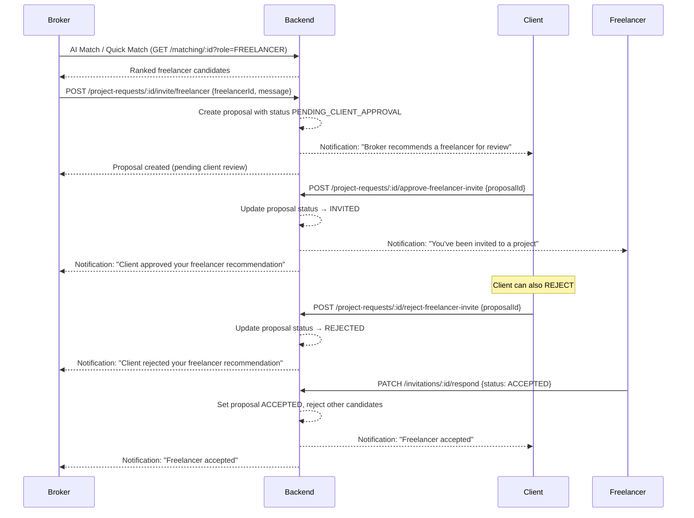

# Broker-Driven Freelancer Invite with Client Approval Gate

The current freelancer invite flow lets anyone (client or broker) invite a freelancer directly — the freelancer immediately sees the invitation and can accept. This changes the flow to: **Broker (HR) finds → Broker invites → Client (Boss) approves → Freelancer sees invite**.

## Flow Diagram



## User Review Required

> [!IMPORTANT]
> **Breaking change to the freelancer invite flow**: Currently, `inviteFreelancer()` sets the proposal to `INVITED` immediately and the freelancer sees it right away. After this change, the proposal starts as `PENDING_CLIENT_APPROVAL` and the freelancer **will not** see the invite until the client approves. Any existing `INVITED` proposals in the DB will continue to work as-is.

> [!IMPORTANT]
> **Who can invite freelancers?** Currently the endpoint has no role guard — anyone can call it. This plan restricts it to the **assigned broker** (or admin/staff). If the client should also be able to invite freelancers directly (bypassing approval, since they ARE the boss), let me know and I'll add that path too.

## Proposed Changes

### Entity Layer

#### [MODIFY] [project-request-proposal.entity.ts](file:///d:/GradProject/SEP492-Project/server/src/database/entities/project-request-proposal.entity.ts)

- No schema change needed — the `status` column is already `varchar` (not an enum type in DB), so `PENDING_CLIENT_APPROVAL` can be stored as-is.
- The `brokerId` column already exists — this will be populated when the broker sends the invite.

---

### Service Layer

#### [MODIFY] [project-requests.service.ts](file:///d:/GradProject/SEP492-Project/server/src/modules/project-requests/project-requests.service.ts)

**1. `inviteFreelancer()` (line ~1089)** — Change to broker-owned flow:
- Add `inviterId` parameter and validate that the inviter is the assigned broker (or admin/staff)
- Set proposal status to `PENDING_CLIENT_APPROVAL` instead of `INVITED`
- Store `brokerId` on the proposal  
- Notify the **client** (not the freelancer yet) that a freelancer recommendation is pending review

**2. New method `approveFreelancerInvite(requestId, proposalId, clientId)`:**
- Validate client owns the request
- Validate proposal exists and is in `PENDING_CLIENT_APPROVAL`
- Update status to `INVITED`
- Notify the freelancer ("You've been invited")
- Notify the broker ("Client approved your recommendation")

**3. New method `rejectFreelancerInvite(requestId, proposalId, clientId)`:**
- Validate client owns the request
- Validate proposal is in `PENDING_CLIENT_APPROVAL`
- Update status to `REJECTED`
- Notify the broker ("Client rejected your recommendation")

**4. `getInvitationsForUser()` (line ~1121)** — No change needed for freelancer path since it already filters `status: 'INVITED'` only. Freelancers will not see `PENDING_CLIENT_APPROVAL` proposals.

**5. `buildFreelancerSelectionSummary()` (line ~409):**
- Add `pendingClientApproval` count to the summary output

**6. `buildViewerPermissions()` (line ~297):**
- Add `canApproveFreelancerInvite: isClient && phase >= 3 && hasPendingApprovals`
- Update `canInviteFreelancer` to be broker-only (already partially correct: `isAssignedBroker || isInternal`)

---

### Controller Layer

#### [MODIFY] [project-requests.controller.ts](file:///d:/GradProject/SEP492-Project/server/src/modules/project-requests/project-requests.controller.ts)

**1. `inviteFreelancer()` (line ~294):**
- Add `@Roles(UserRole.BROKER, UserRole.ADMIN, UserRole.STAFF)` guard
- Pass `@GetUser()` user to service so broker identity is tracked

**2. New endpoint `POST :id/approve-freelancer-invite`:**
- `@Roles(UserRole.CLIENT)`
- Body: `{ proposalId: string }`
- Calls `service.approveFreelancerInvite()`

**3. New endpoint `POST :id/reject-freelancer-invite`:**
- `@Roles(UserRole.CLIENT)`
- Body: `{ proposalId: string }`
- Calls `service.rejectFreelancerInvite()`

---

### Frontend — Client View

#### [MODIFY] [RequestDetailPage.tsx](file:///d:/GradProject/SEP492-Project/client/src/features/requests/RequestDetailPage.tsx)

- When the client views a request in Phase 3+, show a **"Pending Freelancer Recommendations"** section listing proposals with status `PENDING_CLIENT_APPROVAL`
- Each card shows: freelancer name, trust score, matched skills, broker's message
- Two action buttons: **Approve** and **Reject**
- On approve → call `POST /project-requests/:id/approve-freelancer-invite`
- On reject → call `POST /project-requests/:id/reject-freelancer-invite`

---

### Frontend — Broker View (already mostly done)

#### [MODIFY] [RequestFreelancerMarketPanel.tsx](file:///d:/GradProject/SEP492-Project/client/src/features/requests/components/RequestFreelancerMarketPanel.tsx)

- Keep current AI matching + invite flow (already broker-centric from `viewerPermissions`)
- After inviting, show the proposal as **"Pending Client Review"** instead of assuming it's live
- Add a visible list of "Freelancers You've Recommended" with their current approval status

---

### Frontend — API Layer

#### [MODIFY] [api.ts or wizardService.ts](file:///d:/GradProject/SEP492-Project/client/src/features/wizard/services/wizardService.ts)

- Add `approveFreelancerInvite(requestId, proposalId)` API call
- Add `rejectFreelancerInvite(requestId, proposalId)` API call

---

## Verification Plan

### Automated Tests

Existing test file: [project-requests.service.spec.ts](file:///d:/GradProject/SEP492-Project/server/src/modules/project-requests/project-requests.service.spec.ts)

Run with:
```bash
cd server && npx jest --testPathPattern=project-requests.service.spec --verbose
```

**New test cases to add:**

1. **`inviteFreelancer` creates proposal with `PENDING_CLIENT_APPROVAL` status and records `brokerId`**
2. **`approveFreelancerInvite` transitions proposal from `PENDING_CLIENT_APPROVAL` → `INVITED`**
3. **`approveFreelancerInvite` rejects if caller is not the request owner**
4. **`approveFreelancerInvite` rejects if proposal is not in `PENDING_CLIENT_APPROVAL`**
5. **`rejectFreelancerInvite` transitions proposal to `REJECTED`**
6. **`rejectFreelancerInvite` rejects if caller is not the request owner**
7. **Freelancer `respondToInvitation` still only works on `INVITED` status (not `PENDING_CLIENT_APPROVAL`)**

### Manual Verification

> [!NOTE]
> Please advise on the best way to manually test the full 3-party flow (Broker → Client → Freelancer). If you have test accounts set up, I can write specific step-by-step instructions. Otherwise, the unit tests above will cover the core logic.
